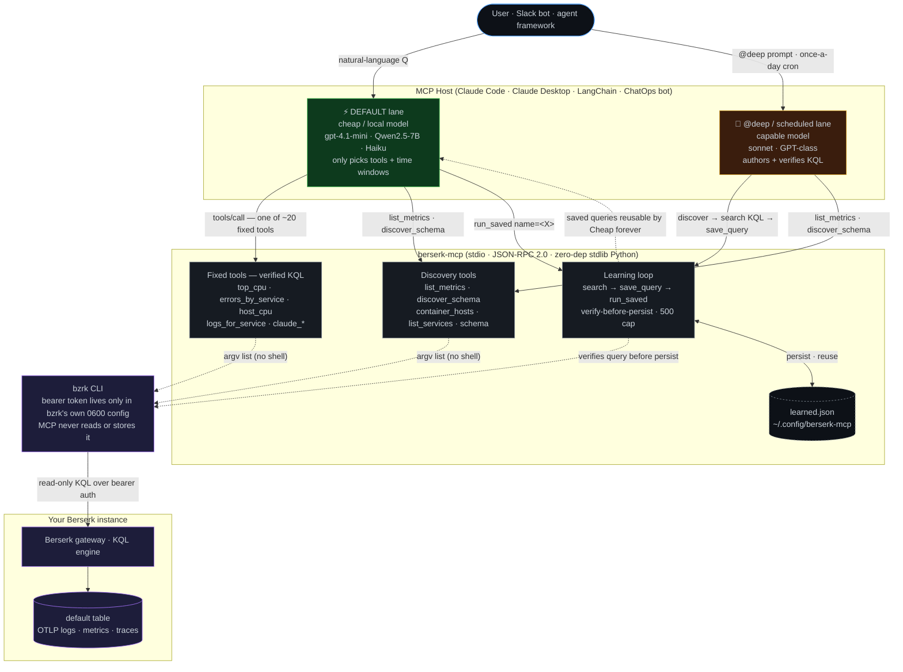

# berserk-mcp

An [MCP](https://modelcontextprotocol.io) server that lets an LLM answer
[Berserk](https://berserk.dev) observability questions by **calling tools**
instead of hand-authoring KQL.

> **Why this matters:** when you hand a model a raw query language, it guesses —
> wrong table names, wrong field names, subtly broken aggregations — and you pay
> for the retries. Every tool here wraps a *verified* Kusto/KQL query, so the
> model picks an intent (`top_cpu`, `errors_by_service`, `claude_sessions`) and
> the query is fixed. Determinism is the whole point. In practice this makes
> even small/cheap models answer observability questions reliably.

- **Zero dependencies.** Pure Python standard library — nothing to `pip` beyond the package itself.
- **Single file.** `berserk_mcp.py` is the entire server. Easy to read, audit, and vendor.
- **Cross-platform.** Runs anywhere the `bzrk` CLI is installed, Windows included.
- **Safe by construction.** Fixed queries, input validation on the two free-text tools, no `shell=True`, and the Berserk token never touches this code.

> ## ⚠️ Disclaimer — please read
>
> This is an **unofficial, community-built** project. It is **not affiliated with,
> sponsored by, endorsed by, or supported by the Berserk project or its maintainers.**
> It interacts with Berserk only through the public `bzrk` CLI — no internal APIs, no
> reverse engineering.
>
> Provided **as-is, with no warranty and no liability** for any use, outcome, downtime,
> data loss, cost incurred, or other consequence (see [LICENSE](LICENSE)). You run it
> at your own risk against your own infrastructure. If you point it at a production
> Berserk, that's your call.
>
> Bugs, feature requests, and questions about *this* server: open an issue here.
> Anything about Berserk itself goes to the Berserk project — not us.

## Why this exists

**Berserk** is a self-hosted observability backend: it ingests logs, metrics, and
traces over OTLP and lets you query them with a Kusto-style language (KQL) through
the `bzrk` CLI or its web UI. It's the storage and the query engine, and it assumes
a human who already knows KQL.

**The gap.** A raw query language is the one thing LLMs are reliably bad at. Point a
model at `bzrk` and it invents table names, mistypes fields, and burns tokens on
retries. The obvious fixes — pasting the schema into the prompt, few-shot KQL
examples — were tried first and *didn't hold*: the model kept guessing. Hardcoding
the queries did.

**What berserk-mcp adds.** It's a thin translation layer in front of Berserk that
exposes observability *intents* as MCP tools (`top_cpu`, `errors_by_service`,
`logs_for_service`, …). Each wraps a query already verified against the live schema,
so the model never authors KQL — it picks an intent and a time window. It does **not**
replace Berserk's storage, query engine, or UI; it makes them **agent-accessible and
reliable on small / cheap / local models**. A `search` escape hatch still allows
arbitrary KQL when you need it, and a learning loop (`save_query` → `run_saved`) turns
a one-off query into a permanent, named tool.

| Approach | Result |
|---|---|
| Berserk web UI / `bzrk` CLI | Great for a human who knows KQL; not usable by an agent. |
| Point an LLM at the raw CLI + schema docs | Unreliable — models guess table/field names and pay for retries. |
| A generic "text-to-KQL" MCP | Still *authors* queries → same guessing problem, one layer up. |
| **berserk-mcp** | Fixed, verified queries → deterministic answers, even from a 7B local model. |

### How the lanes talk to each other and to Berserk



Two things the diagram makes obvious that the prose doesn't:

1. **The bearer token never enters this code.** `bzrk` owns it in its own 0600 config; the MCP shells out via an argv list (no shell, no token in process memory, no token in logs).
2. **The learning loop closes back into the cheap lane.** Pay the capable model once to author + verify a query, and the cheap lane runs it free forever via `run_saved` — that's the cost story in one arrow.

### What this adds vs. default Berserk

Berserk is a great human-facing observability backend on its own. This server doesn't
replace any of it — it sits next to it and adds the agent-facing surface. Concretely:

| Capability | Default Berserk | berserk-mcp |
|---|---|---|
| Ingest OTLP logs / metrics / traces | ✅ core | reuses |
| KQL query engine + storage | ✅ core | reuses (read-only) |
| Web UI + `bzrk` CLI for humans | ✅ core | reuses |
| Token auth, profiles | ✅ core | reuses (`bzrk` holds the token) |
| **MCP surface for LLMs / agents** | — | ✅ |
| **Common questions answered without authoring KQL** | requires the model write correct KQL → small models fail | ✅ fixed verified tools (`top_cpu`, `errors_by_service`, …) |
| **Telemetry-shape discovery** (what metrics? what keys? container → host?) | partial (`.show tables`, `getschema`) | ✅ `list_metrics` · `discover_schema` · `container_hosts` |
| **Custom-query persistence** as named, reusable tools | n/a (CLI history only) | ✅ `save_query` (verify-before-persist) → `run_saved` |
| **Two-lane cost model** (cheap default · on-demand `@deep`) | n/a (UX concern) | ✅ tool descriptions + annotations make this safe |
| **KQL-injection guards** on free-text inputs | n/a (humans) | ✅ service-name allowlist · `claude_search` reject-list |

### What it looks like — worked examples

Concrete prompts you can paste into any MCP-aware client (Claude Code, Claude Desktop,
a Slack/Discord bot, an agent framework). Each shows the natural-language ask, which
tools the model ends up calling, and the kind of answer you get back. These all work on
the cheap default lane — no frontier model required.

**ChatOps: "any errors in the last hour?"**

```
Have there been any errors in the last hour, and from which service?
```

> Calls `errors_by_service` (`since="1h ago"`). The model replies with the per-service
> error count, or "no errors recorded" when the result is empty. Drop this in a Slack
> bot and you've got a one-line health probe.

**On-call triage: "which VM is loaded, and what's running on it?"**

```
Is the busiest VM by CPU load also the one running the highest-CPU container?
Name both.
```

> Calls `host_cpu` *and* `top_cpu`, then joins the answer for you. With `container_hosts`
> in the toolbox the model can map the container back to its host without guessing from
> the name. Verified end-to-end on `gpt-4.1-mini` — see [evals/model-eval-plan.md](evals/model-eval-plan.md).

**Onboarding a new telemetry source you just started shipping**

```
I just added HAProxy logs to Berserk. Show me the shape of those records and
suggest a query that counts errors per backend.
```

> Calls `discover_schema(service="haproxy")` (returns the resource keys + a row sample),
> then `search` for the proposed KQL. If you like the query, ask the model to
> `save_query` it — next time anyone asks about HAProxy errors, `run_saved` answers
> instantly on the cheap lane. This is the "self-extending" loop in practice.

**Autonomous daily health digest (cron / scheduled agent)**

```
You are an on-call assistant. Use the Berserk MCP to:
1) Check load per host (host_cpu, host_memory) over the last 6 hours.
2) Count errors per service over the last 24 hours (errors_by_service).
3) List the top 5 noisiest containers (top_memory).
Write a 10-line digest, flag anything that looks anomalous, and stop.
```

> Deterministic enough to run unattended overnight on `gpt-4.1-mini` or a local
> Qwen2.5-7B. Wire it to a cron job; the answer is short and parseable.

**Claude Code observability (bonus)**

```
What tools has Claude Code used most this week, and were there any errors?
```

> Calls `claude_tools` + `claude_errors`. Only works if you ship Claude Code session
> logs into Berserk (any OTLP forwarder will do — see [docs/claude-code.md](docs/claude-code.md));
> if you don't, ignore — the other tools work without it.

### Who it's for

- **ChatOps** — Slack / Discord / Teams bot answering plain-language questions, backed
  by *your own* Berserk. No third-party SaaS, no telemetry leaving your network.
- **Autonomous monitoring agents** — scheduled jobs that summarise, flag, or open
  tickets, cheap enough to run unattended.
- **On-call triage from your editor** — ask about production from inside Claude Code or
  Claude Desktop without switching to a dashboard.
- **Any telemetry source** — tools query generically by service / host / metric, so any
  OTLP feed (containers, VMs, Kubernetes, app code, edge devices) is queryable the same
  way, with no per-source configuration.

## Requirements

- Python 3.8+
- The [`bzrk`](https://berserk.dev) CLI, installed and authenticated to your Berserk instance (a working profile that `bzrk -P <profile> search "..."` can use). The bearer token lives in `bzrk`'s own config — this server never reads or stores it.

## Install

```bash
pip install berserk-mcp
# or, isolated:
pipx install berserk-mcp
# or run without installing:
uvx berserk-mcp
```

From source:

```bash
git clone https://github.com/ssi0202/berserk-mcp
cd berserk-mcp
pip install .
```

The single file has no dependencies, so you can also just drop `berserk_mcp.py`
somewhere and run `python berserk_mcp.py`.

## Configure

All configuration is via environment variables — all optional:

| Variable | Default | Purpose |
|---|---|---|
| `BZRK_BIN` | `bzrk` | Path/name of the Berserk CLI binary. |
| `BZRK_PROFILE` | `local` | The `bzrk` profile to query. |
| `BZRK_TIMEOUT` | `120` | Per-query timeout, seconds. |
| `BERSERK_TABLE` | `default` | The Berserk table to query. |
| `BERSERK_MCP_LEARNED_PATH` | per-user config dir | Where saved queries persist (see [Learning loop](#learning-loop)). |

## Connect it to a client

### Claude Desktop

Add to `claude_desktop_config.json` (Settings → Developer → Edit Config):

```json
{
  "mcpServers": {
    "berserk-q": {
      "command": "berserk-mcp",
      "env": { "BZRK_PROFILE": "local" }
    }
  }
}
```

If you didn't `pip install` it, point at the file instead:

```json
{
  "mcpServers": {
    "berserk-q": {
      "command": "python",
      "args": ["/absolute/path/to/berserk_mcp.py"],
      "env": { "BZRK_PROFILE": "local" }
    }
  }
}
```

### Claude Code

```bash
claude mcp add berserk-q -- berserk-mcp
# or from source:
claude mcp add berserk-q -- python /absolute/path/to/berserk_mcp.py
```

### Any MCP client

Launch `berserk-mcp` (or `python berserk_mcp.py`) as a stdio MCP server. It speaks
newline-delimited JSON-RPC 2.0 over stdio.

## Using it with agents and bots

This is a standard **stdio MCP server**, so anything that can host an MCP server can
drive it — the host (your agent framework, Slack/Discord bot, or chat app) is the MCP
*client*; it spawns `berserk-mcp` as a subprocess and calls the tools.

- **Agent frameworks** (LangChain/LangGraph, the OpenAI/Anthropic Agents SDKs,
  smolagents, PydanticAI, etc.) all have an MCP-stdio adapter. Point it at the
  `berserk-mcp` command; the 19 tools appear automatically, with their `title`,
  `description`, and `annotations`.
- **Slack / Discord / Teams bots.** Run the bot as the MCP host on the same machine
  (or container) as a configured `bzrk`. The bot turns a message into a model turn,
  the model calls the tools, and the bot posts the answer back. Because the tools are
  read-only (see annotations), you can safely auto-approve them in the bot's policy.
- **Remote / shared deployment.** stdio is local-subprocess by design. To expose one
  server to several remote clients, run it behind an MCP stdio→HTTP bridge (e.g.
  `mcpo`/`supergateway`) and put auth + TLS in front — don't expose it raw. (A native
  Streamable-HTTP transport is on the roadmap; open an issue if you need it.)

The server holds no Berserk credentials of its own and only issues read-only KQL, so
the trust boundary is just "who can reach this process and what's in your telemetry."

## Choosing a model

The whole point of the fixed-query design is that **the model never writes KQL** — it
only picks a tool and a time window. That collapses the capability bar from "can author
correct Kusto" down to "can do basic tool-calling," which is exactly what makes cheap
and local models viable here. Lead with the cheapest thing that works:

- **Local (preferred).** Any Ollama/LM-Studio model with solid tool-calling: the
  **Qwen2.5-Instruct** family (7B is the sweet spot; 3B works for simple asks),
  **Llama 3.1/3.3**, or **Mistral-Small**. A 7B Q4 model fits in ~5–6 GB of VRAM and
  selects among these tools reliably because the names and `instructions` are
  unambiguous. Tiny models (≤2B) and CPU-only prefill struggle with the agentic
  tool-call loop — prefer a GPU and ≥7B for unattended use.
- **Cheap API (when local won't fit or you need speed).** `gpt-4.1-mini`, Claude
  **Haiku**, or Gemini **Flash** — all have strong tool use at a fraction of frontier
  cost. These are a good fit for latency-sensitive ChatOps replies.
- **Frontier models** are rarely necessary here; save them for open-ended
  investigations that lean on the `search` escape hatch.

Biggest reliability lever, regardless of model: the tool **descriptions**. They're
written to be narrow and unambiguous so a small model can route correctly — keep them
that way if you add tools.

## Tools

| Tool | What it answers |
|---|---|
| `list_containers` | Containers currently sending metrics (with sample counts). |
| `top_cpu` | Containers ranked by CPU %. |
| `top_memory` | Containers ranked by memory (MB). |
| `errors_by_service` | ERROR-level log counts grouped by service. |
| `list_services` | All services/sources, with log vs metric breakdown. |
| `list_hosts` | All hosts reporting telemetry, by record count. |
| `host_cpu` | Per-**host** CPU (1-minute load average). |
| `host_memory` | Per-**host** memory used (GB). |
| `container_hosts` | Which host/VM each container runs on (join key for container↔host questions). |
| `logs_for_service` | Recent log lines for one service. |
| `schema` | Live tables + column schema introspection. |
| `list_metrics` | Every metric name being ingested, with counts (discovery). |
| `discover_schema` | Sample rows to learn an unknown source's `resource`/`attributes` shape (discovery). |
| `search` | Run arbitrary KQL (escape hatch). |

Every query tool takes an optional `since` argument (`"15m ago"`, `"1h ago"`,
`"2d ago"`, …) with a sensible per-tool default.

**Per-host vs per-container:** `host_cpu`/`host_memory` report per **host**
(from host metrics); `top_cpu`/`top_memory` report per **container**. The tool
descriptions cross-reference each other so the model picks the right one.

### Claude Code telemetry tools

If you ship your Claude Code session logs into Berserk (service name
`claude-code`), five extra tools mine that data: `claude_recent`,
`claude_sessions`, `claude_tools`, `claude_errors`, and `claude_search`. See
[docs/claude-code.md](docs/claude-code.md) for the data shape and pipeline.

## Learning loop

When a question isn't covered by a standard tool, the model uses `search` to
answer it — then can persist the working query with `save_query`. Three tools
make this a one-time cost:

- `list_saved` — list saved queries (check here before authoring new KQL).
- `run_saved` — run a saved query by name (deterministic, no authoring).
- `save_query` — verify a query runs, then persist it under a name.

`save_query` runs the query once before persisting; a query that errors is **not**
saved. The store is capped at 500 entries. Saved queries live in
`BERSERK_MCP_LEARNED_PATH` (default: your platform config dir, e.g.
`~/.config/berserk-mcp/learned.json`).

## Self-extending: discovery + learning

The fixed tools cover known telemetry. For data the server *doesn't* have a tool for
yet — a log source you just started shipping — there's a loop that lets the MCP extend
itself without hand-editing code, while staying deterministic for the cheap lane:

```
DISCOVER   list_metrics / discover_schema / list_services  →  "what's in here now?"
AUTHOR     search "<KQL for the new data>"                  →  a working query
PERSIST    save_query                                       →  a permanent, named tool
REUSE      run_saved <name>                                 →  cheap model, free, forever
```

The intended division of labour (cost-efficient):

- **A capable model does the rare, hard part** — discover the new shape, author + verify
  the query, `save_query` it. Trigger it two ways: on a **schedule** (a daily job that
  diffs `list_metrics`/`discover_schema` against a stored baseline and only authors when
  something new appears), or **on demand** ("I'm now shipping HAProxy logs to Berserk —
  add support"). Authoring KQL is the one thing small models are weak at, so gate this
  behind the stronger model or a human; `save_query` verifies the query runs before it
  persists, as a guardrail.
- **The cheap model reaps the result** — every saved query is reusable for free via
  `run_saved`, deterministically.

This scales because **learned queries live behind `list_saved`/`run_saved`, not as
first-class tools** — so you can learn dozens of new sources without growing the ~20-tool
routing surface that keeps the cheap model reliable.

## Security

- **Injection guards.** `logs_for_service` validates the service name against
  `[A-Za-z0-9._-]`, and `claude_search` rejects quotes, pipe, backslash, and
  backtick — both are interpolated into KQL string literals, so this blocks
  single-quote injection. The `since` window is validated against a strict time
  grammar. All other standard tools use fixed queries with no interpolation.
- **Read-only by construction.** Every tool is annotated (`readOnlyHint`) and only
  issues read KQL; the sole exception is `save_query`, which writes to a *local*
  query file (never to Berserk). Clients can use the annotations to auto-approve the
  read tools.
- **`search` / `save_query` accept arbitrary KQL by design** — but KQL is
  read-only; it cannot mutate data.
- **No shell.** `subprocess` is always invoked with an argument list (never
  `shell=True`); there is no `eval`.
- **No secrets in this code.** The Berserk bearer token lives only in `bzrk`'s
  own config. This server never reads, stores, or logs it.
- **Note on output.** Tool results are whatever your telemetry contains. If logs in
  Berserk hold sensitive values, `logs_for_service`/`search` can surface them —
  redact at ingest (e.g. in your OTLP forwarder), not here.

To report a vulnerability, see [SECURITY.md](SECURITY.md).

## Extending — add a new tool in five minutes

The whole point of this server is fixed, verified queries — so adding a tool is a
small, mechanical ritual. Aim to keep the routing surface small (~20 tools) and let
the long tail accumulate behind `save_query`/`run_saved` via the [learning loop](#self-extending-discovery--learning).

**1. Find the KQL on a live instance.** Iterate with `bzrk` until the query returns
clean rows — names, units, sort order, all the things a model would otherwise have
to invent. *Don't ship a query you haven't seen succeed against real data.*

```bash
bzrk -P local search "default | where metric_name == 'system.network.io' \
  | summarize bytes=sum(value) by host=tostring(resource['host.name'])" \
  --since "1h ago"
```

**2. Drop it into `berserk_mcp.py`** — usually two lines for a fixed-query tool.
The `Q_*` constant is the verified KQL; the `SIMPLE` entry wires it to the dispatcher
with a sensible default time window.

```python
Q_HOST_NET = (
    f"{T} | where metric_name == 'system.network.io' "
    f"| summarize bytes=sum(value) by host=tostring(resource['host.name']) "
    f"| sort by bytes desc"
)
SIMPLE = {
    # ...
    "host_network": (Q_HOST_NET, "30m ago"),
}
```

**3. Tell the model what the tool is for.** Tool description = router signal. Write
it narrowly enough that a small model can pick it without context — cross-reference
the close cousins (`host_memory`, `top_memory`) so the model doesn't confuse per-host
with per-container.

```python
TOOLS.append({
    "name": "host_network",
    "description": "Total network bytes (sum) per host. Per-HOST; for per-container "
                   "network use `search` for now.",
    "inputSchema": {"type": "object", "properties": _since()},
})
TITLES["host_network"] = "Per-Host Network I/O"
```

The default `_READ` annotations apply automatically. Override in `_ANNOTATIONS` only
if the new tool isn't read-only or doesn't hit the network (rare).

**4. Lock the query string with a test** so future refactors can't quietly change it:

```python
def test_q_host_net_locked(self):
    self.assertEqual(bm.Q_HOST_NET,
        "default | where metric_name == 'system.network.io' "
        "| summarize bytes=sum(value) by host=tostring(resource['host.name']) "
        "| sort by bytes desc")
```

**5. Run the suite + re-register with your MCP client.** Clients cache the tool list
at `mcp add` time, so a `remove` + `add` cycle is needed after shipping the change.

```bash
python tests/test_berserk_mcp.py     # 31 (+yours) tests, no live Berserk required
claude mcp remove berserk-q && claude mcp add berserk-q -- berserk-mcp
```

That's it. A tool that touches free-text input (a service name, a search term) needs an
allow-list (see `logs_for_service`); a tool that needs two `bzrk` round-trips can
follow `discover_schema`'s pattern. Both patterns are in the source as templates.

## Testing

```bash
python tests/test_berserk_mcp.py     # 31 tests, no live Berserk required
```

The tests stub the `bzrk` CLI, so they verify the generated KQL, default time
windows, injection guards, `since` validation, tool annotations, the JSON-RPC
protocol, and the learning loop — all offline. Run them on every PR; CI does too.

## Contributing

Issues, ideas, and PRs are all welcome — see [CONTRIBUTING.md](CONTRIBUTING.md) for
the short version (what's a good first contribution, how queries get verified, the
two-line code style). The bar is low: if the tests pass, the description is narrow,
and the query has been seen working against real data, it's mergeable.

Good first contributions if you're looking for one:

- A new fixed-query tool for telemetry you actually care about (cheapest win — the
  five-step ritual above).
- A worked example for your stack (Kubernetes, ECS, Nomad, …) under [docs/](docs/).
- Sharpening a tool description that confused your model — the descriptions are the
  router; a clearer one is a real correctness improvement.
- Filing an issue when you hit something the server *should* have a tool for. We'd
  rather know than guess.

## License

[MIT](LICENSE).
