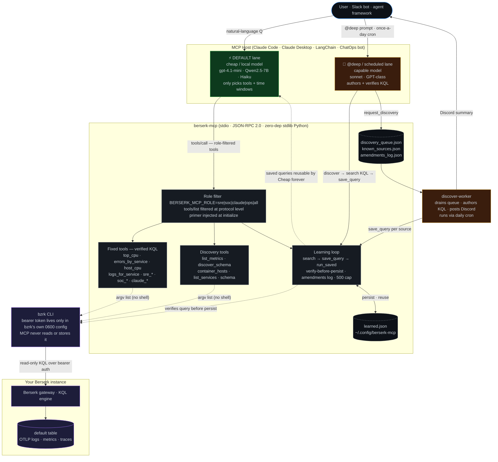

# berserk-mcp

[](https://github.com/ssimonsen0202/berserk_mcp/actions/workflows/ci.yml)

berserk-mcp is an [MCP](https://modelcontextprotocol.io) server. It lets an
LLM answer [Berserk](https://bzrk.dev) observability questions. The LLM
**calls tools** for this. The LLM does not write KQL by hand.

> **Why this matters:** A raw query language makes a model guess. It guesses
> wrong table names, wrong field names, and broken aggregations. Each wrong
> guess costs you a retry. Every tool in berserk-mcp wraps one *verified*
> Kusto/KQL query. The model picks an intent — for example `top_cpu`,
> `errors_by_service`, or `sre_host_headroom`. The query itself stays fixed.
> This fixed-query design is the whole point. It lets even small or cheap
> models answer observability questions reliably.

- **Works with Claude Desktop, Claude Code, and any MCP client.** berserk-mcp speaks MCP protocol version `2025-06-18` over stdio (newline-delimited JSON-RPC 2.0). It implements every required method — `initialize`, `notifications/initialized`, `ping`, `tools/list`, `tools/call` — with strict envelope validation and adversarial regression tests. See [Connect it to a client](#connect-it-to-a-client) for `claude_desktop_config.json` and `claude mcp add` recipes.
- **Zero dependencies.** berserk-mcp uses only the Python standard library. You do not `pip install` anything beyond the package itself. (The optional LLM parser factory uses `urllib`. It still adds no third-party dependency.)
- **Tiny and auditable.** berserk-mcp has five small stdlib modules: `berserk_mcp.py` (the MCP server), `parser_factory.py` (the optional LLM parser generator), `agent_analytics.py` (Claude Code analytics), `secret_scan.py` (secret detection and redaction), and `ingestion_advisor.py` (catalog-backed telemetry gap analysis). You can read, audit, and vendor each module easily.
- **Cross-platform.** berserk-mcp runs anywhere the `bzrk` CLI runs, including Windows.
- **Safe by construction.** berserk-mcp uses fixed queries. It validates input on every free-text tool. It never calls `shell=True`. The Berserk token never touches this code.
- **Self-extending (new in 1.7).** An optional [parser factory](#parser-factory-llm-generated-query-packs) detects *new* sources arriving in Berserk. It uses an LLM to author, execute-verify, and save KQL "query packs" for each new source. The design follows Microsoft Sentinel's [ASIM parser AI agent](https://learn.microsoft.com/en-gb/azure/sentinel/normalization-create-parsers-ai-agent). It tries cheap providers first, enforces hard runaway fail-safes, and never lets a generated query overwrite a human one.

> ## ⚠️ Disclaimer — please read
>
> berserk-mcp is an **unofficial, community-built** project. The Berserk project
> and its maintainers do **not** sponsor, endorse, support, or affiliate with it.
> berserk-mcp talks to Berserk only through the public `bzrk` CLI. It uses no
> internal API and no reverse engineering.
>
> berserk-mcp is provided **as-is, with no warranty and no liability**. This
> covers any use, outcome, downtime, data loss, or cost (see [LICENSE](LICENSE)).
> You run berserk-mcp at your own risk against your own infrastructure. Pointing
> it at a production Berserk is your decision.
>
> For bugs, feature requests, and questions about *this server*: open an issue
> in this repository. For questions about Berserk itself: contact the Berserk
> project, not this repository.

## Release history

Current version: **1.18.0**. This is a bullet-point overview, most recent
first — full detail for each notable release lives in
[`docs/releases/`](docs/releases/).

- **v1.18.0** (2026-07-23) — Adds fleet-friendly worker jitter, interactive
  query budgets, timeout cooldowns, short-TTL read-only caching, and three
  guarded SRE/SOC tools: `detect_anomalies`, `forecast_capacity`, and
  `find_similar`. See [details](docs/releases/v1.18.0.md).
- **v1.17.0** (2026-07-23) — Adopts native Berserk functions (`make-series`,
  `series_fit_line`, `fieldstats`, `tail`, `extract_log_template`, …) across
  the query builders. See [details](docs/releases/v1.17.0.md).
- **v1.16.0** (2026-07-23) — Berserk-native query optimization pass; adds
  the `claude.file_targets`-based cost-attribution fix and the KQL
  performance guide. See [details](docs/releases/v1.16.0.md).
- **v1.15.0** (2026-07-20) — Phase J deep analytics (`claude_cost_report`,
  `claude_session_deep_dive`, `claude_workflow_insights`), a 9-finding
  security hardening pass, and the Discord alert integration. See
  [details](docs/releases/v1.15.0.md).
- **v1.14.1** (2026-07-18) — Fixed a silent-failure bug in the agent-analytics
  tools' `bzrk --json` parsing. See [details](docs/releases/v1.14.1.md).
- **v1.14.0** (2026-07-17) — Distributed-trace analysis tools
  (`trace_find_slow`, `trace_find_errors`, `trace_analyze`), shipped
  unverified then live-verified against a real cluster outage. See
  [details](docs/releases/v1.14.0.md).
- **v1.12.0** (2026-07-15) — Agent-log analytics (`claude_loop_check`,
  `claude_model_fit`, `claude_token_burn`), secret detection/redaction, and
  the ingestion advisor (`suggest_ingestion`). See
  [details](docs/releases/v1.12.0.md).
- **v1.7.1** — Runaway fail-safes for source auto-detection.
- **v1.7.0** — LLM-driven parser factory for new Berserk sources.
- **v1.6.2** — Security review findings from the 2026-07-05 pass.
- **v1.6.0–1.6.1** — Role profiles (SRE/SOC/Claude/Ops), role primers,
  amendments logging, and early hardening fixes.
- **v1.2.0–1.5.0** — Initial release through discovery tools, dual-perspective
  `discover_schema`, and `bzrk_query_perf`. See `git log` for individual
  commits.

## Why this exists

**Berserk** is a self-hosted, OTEL-native, schemaless observability engine. It
is built for petabyte scale. Berserk ingests logs, metrics, and traces over
OTLP. You query this data with a Kusto-style language (KQL), through the
`bzrk` CLI or the web UI. Berserk is [headless by design](https://www.bzrk.dev):
built for "agents asking questions," not for dashboards. Berserk supplies the
storage and the query engine. On its own, Berserk still assumes the asker —
human or agent — already knows KQL.

**The gap.** A raw query language is the one thing LLMs handle badly. Point a
model at `bzrk` directly, and it invents table names, mistypes fields, and
burns tokens on retries. Two obvious fixes were tried first: pasting the
schema into the prompt, and few-shot KQL examples. Neither fix held — the
model kept guessing. Hardcoding the queries did work.

**What berserk-mcp adds.** berserk-mcp is a translation layer in front of
Berserk. It exposes observability *intents* as MCP tools — for example
`top_cpu`, `errors_by_service`, `sre_service_health`. Each tool wraps a query
already verified against the live schema. The model never authors KQL; it
picks an intent and a time window. berserk-mcp does **not** replace Berserk's
storage, query engine, or UI. It makes them **agent-accessible and reliable
on small, cheap, or local models**.

Beyond the fixed tools, berserk-mcp adds three layers that default Berserk
does not have:

1. **Role lanes** — tool visibility filtered by job function, so each agent sees only the tools it needs
2. **Discovery queue and auto-KQL worker** — automated onboarding for new telemetry sources
3. **Amendments log** — every `save_query` write is tracked, so a worker can post changelogs and keep the query store auditable

| Approach | Result |
|---|---|
| Berserk web UI / `bzrk` CLI | Good for a human who knows KQL. Not usable by an agent. |
| Point an LLM at the raw CLI and schema docs | Unreliable. Models guess table and field names, and pay for retries. |
| A generic "text-to-KQL" MCP | Still *authors* queries. Same guessing problem, one layer up. |
| **berserk-mcp** | Fixed, verified queries. Deterministic answers, even from a 7B local model. |

### What this adds vs. default Berserk

Berserk is a strong human-facing observability backend on its own. berserk-mcp
does not replace any of it. berserk-mcp sits next to Berserk and adds the
agent-facing surface:

| Capability | Default Berserk | berserk-mcp |
|---|---|---|
| Ingest OTLP logs / metrics / traces | ✅ core | reuses |
| KQL query engine + storage | ✅ core | reuses (read-only) |
| Web UI + `bzrk` CLI for humans | ✅ core | reuses |
| Token auth, profiles | ✅ core | reuses (`bzrk` holds the token) |
| **MCP surface for LLMs / agents** | — | ✅ |
| **Common questions answered without authoring KQL** | requires correct Kusto → small models fail | ✅ fixed verified tools |
| **Role-aware tool filtering** (SRE / SOC / Claude / Ops lanes) | — | ✅ `BERSERK_MCP_ROLE` env var |
| **Role primers** injected at `initialize` | — | ✅ KQL rules, thresholds, routing guidance per lane |
| **Telemetry-shape discovery** | partial (`.show tables`) | ✅ `list_metrics` · `discover_schema` · `container_hosts` |
| **Custom-query persistence** as named, reusable tools | UI has a Query Library. Berserk documents no API or CLI verb to create, list, or share a saved query programmatically | ✅ `save_query` (verify-before-persist) → `run_saved`, agent-readable |
| **Automated source onboarding** | — | ✅ `request_discovery` → worker → saved query, no KQL authoring needed |
| **LLM parser factory** — detect a new source, auto-author + verify a KQL query pack | — | ✅ `detect_new_sources` · `generate_parser` · `run_discovery_worker` · `review_generated` (ASIM-agent-style; see [below](#parser-factory-llm-generated-query-packs)) |
| **Query changelog / amendments log** | — | ✅ every `save_query` write tracked; `--worker` posts a Discord diff if [alerting is configured](#configuring-discord-alerts) |
| **Two-lane cost model** (cheap default · on-demand `@deep`) | — | ✅ tool descriptions + annotations make this safe |
| **KQL-injection guards** on free-text inputs | n/a (humans) | ✅ service-name allowlist · `claude_search` reject-list |
| **Trace/span analysis** — find slow/failed traces, reconstruct a span tree with correlated logs | — | ✅ `trace_find_slow` · `trace_find_errors` · `trace_analyze` (v1.14.0; see [Trace tools](#trace-tools-all-lanes)) |

### Why this complements Berserk's native MCP (not competes with it)

Berserk ships its own MCP server, `bzrk mcp`. It is a raw query console:
`query`/`start_query` sessions, table/database discovery, and `get_docs` for
KQL reference. Its design bet is "the agent writes the KQL." That console is
the right substrate for a human-grade KQL author. It is the wrong everyday
interface for most models — models guess table names, botch aggregations,
and burn tokens on retries.

berserk-mcp is the **deterministic interpretation layer on top of the same
substrate**. The model picks a verified intent. berserk-mcp does the math.
The answer comes back as a conclusion — a verdict, a baseline deviation, a
cost trend — not a row dump.

Use the native MCP when a human-grade KQL author drives the session. Use
berserk-mcp when you want *any* model, including small local ones, to answer
reliably. Both servers run side-by-side in the same client without conflict.

### Sovereign and defense deployments (fully local stack)

Every layer of this stack can run on hardware you own, with zero cloud
egress. This makes it suitable for sovereignty-constrained and defense or
air-gapped environments:

- **Berserk** is self-hosted. Telemetry never leaves your network.
- **berserk-mcp** is pure Python stdlib. It has no third-party packages, no
  telemetry, and no phone-home. You can audit its five small files in an
  afternoon.
- **The LLM layer can run locally too.** The parser factory's provider ladder
  speaks the OpenAI-compatible API. Any locally hosted open-weight model —
  via Ollama, llama.cpp, vLLM, or LM Studio — plugs in as the `hermes`
  endpoint. No frontier API is required. The fixed-query design exists
  precisely so **small local models route reliably**: the model picks a tool
  and a time window; it never authors KQL.
- **Defense-in-depth on the egress path.** Even when an LLM endpoint is
  configured, it receives only structural telemetry — key names, shapes,
  redacted excerpts — never raw values. The endpoint URL is
  scheme-allowlisted and operator-controlled.

#### Bridging Berserk's two use cases: AI Ops without leaving the sovereign boundary

Berserk's own positioning splits into two cases.
[AI Ops](https://www.bzrk.dev/use-cases/ai-ops/) says "any MCP-aware agent can
query your telemetry directly." [Defence](https://www.bzrk.dev/use-cases/defense/)
says "nothing leaves the trust boundary you control." Taken separately, these
two cases pull in opposite directions. The AI Ops case assumes a capable
model that authors KQL and reasons over raw results. But a frontier model is
itself an egress dependency, and the Defence case rules that out.
Berserk-the-engine solves this for the *data*: self-hosted, WORM storage, no
foreign jurisdiction. It does not solve this for the *reasoning layer* on top
of the data.

berserk-mcp closes that gap. The model only ever picks a tool and a time
window. It never authors KQL and never sees raw values. This means a small,
locally hosted open-weight model can drive the whole interaction reliably.
The result is the AI Ops experience — agents ask questions instead of humans
reading dashboards — with the entire agent loop inside the sovereign
boundary, not just the telemetry store.

This is not hypothetical. One real deployment is a Discord-facing agent
called "Hermes." It answers on-call questions against a homelab Berserk
instance. Hermes logs every tool call and every full prompt/reply back into
Berserk itself: model name, redacted arguments, redacted results, and session
ID, all as structured, queryable records. This is the same durable,
back-testable "what did the agent actually do" record that Berserk's AI Ops
page highlights in its Ethira governance case study — running end-to-end
against berserk-mcp instead of a bespoke integration. The `claude_*` tool
family (`claude_cost_report`, `claude_token_burn`, `claude_workflow_insights`,
and others) delivers the same token-usage/BI story from that page. These
tools are already implemented and already answering real queries.

The target operating model is **two-tier local**. A small open-weight model
handles the everyday calls; the goal is ≥ 80% of interactions. The model
escalates to a larger, locally hosted open-weight model only for `@deep`
work: parser generation, deep-dive synthesis, incident narratives. The
measurement plan for picking both tiers is in
[`evals/model-eval-plan.md`](evals/model-eval-plan.md) (Part 3).

---

## Architecture

### How the lanes talk to each other and to Berserk



The diagram makes three things clear:

1. **The bearer token never enters this code.** `bzrk` owns the token in its own 0600 config. berserk-mcp shells out via an argv list: no shell, no token in process memory, no token in logs.
2. **The learning loop closes back into the cheap lane.** Pay the capable model once to author and verify a query. After that, the cheap lane runs the query free, forever, via `run_saved`.
3. **The worker is the automation bridge.** When `request_discovery` queues a new source, the worker drains the queue on its own — it discovers the source, authors KQL, and saves the query, with no operator KQL authoring.

### Monitored hosts (not shown in the diagram)

The diagram above covers the **query path**: how an agent asks questions.
The **ingestion path** is separate. Each monitored host runs a lightweight
`journal-forwarder` script. This script tails selected systemd units and
ships OTLP log payloads through a local `otel-collector` into the Berserk
gateway.

| Host | Key services forwarded |
|---|---|
| **HermesRuntime** | `hermes-discord`, `docker`, `otel-collector`, `ssh` |
| **OpenClaw** | `ollama`, `openclaw`, `docker`, `otel-collector`, `check-esxi-snap`, `ssh` |

Each unit ships under its own `resource['service.name']` — for example
`ollama` or `hermes-discord`. This lets `list_services`, `logs_for_service`,
and `search` filter by the actual service, not by the forwarding mechanism.

---

## Role lanes

Set `BERSERK_MCP_ROLE` to scope what an agent sees. The filter applies at the
MCP protocol level. An unrelated tool never appears in `tools/list`, so it
cannot be called by accident and cannot be injected into context.

| Role | `BERSERK_MCP_ROLE` | Gets | Typical agent |
|---|---|---|---|
| SRE | `sre` | Core tools + SRE tools (error rate, host headroom, ingest health, service health, top errors) | On-call Slack bot, editor assistant |
| SOC | `soc` | Core tools + SOC tools (high-severity logs, log spike, new services, repeated errors, incident timeline) | Security monitoring agent |
| Claude Code | `claude` | Core tools + Claude Code telemetry tools (sessions, tool histogram, errors, full-text search, loop/model-fit checks) | Developer workflow assistant |
| Ops | `ops` | All tools (full visibility) | Operator shell, admin scripts |
| Default | `all` (or unset) | All tools | Development, evaluation |

### Role primers

When a lane connects, berserk-mcp injects a markdown primer into the MCP
`initialize` response, before the standard instructions. Each primer carries:

- **Tool routing table** — which tool to reach for first, for each intent
- **Escalation thresholds** — for example CPU load > 2.0, memory > 85%, error rate > 10/min, ingest lag > 30 s
- **KQL authoring rules** — time window defaults, field name conventions, aggregation patterns
- **Discovery flow guidance** — when to call `request_discovery` instead of authoring ad-hoc KQL

This means the agent config needs no prompt engineering. The routing
knowledge travels with berserk-mcp.

Primers live in `primers/<role>.md`, next to the server file (or at
`BERSERK_MCP_PRIMERS_DIR` if you set it). The `all` and `ops` roles receive no
primer. These roles route from the tool descriptions directly.

---

## Tools

### Core tools (all lanes)

| Tool | What it answers |
|---|---|
| `list_containers` | Containers currently sending metrics (with sample counts). |
| `top_cpu` | Containers ranked by CPU %. Use for container-specific questions; for host CPU use `host_cpu`. |
| `top_memory` | Containers ranked by memory (MB). Use for container-specific questions; for host memory use `host_memory`. |
| `errors_by_service` | ERROR-level log counts grouped by service. |
| `list_services` | All services/sources, with log vs metric breakdown. |
| `list_hosts` | All hosts reporting telemetry (HermesRuntime, OpenClaw, ESXi, …). |
| `host_cpu` | Per-**host** CPU (1-minute load average). Default for ambiguous whole-machine CPU questions. |
| `host_memory` | Per-**host** memory used (GB). Default for ambiguous whole-machine memory questions. |
| `container_hosts` | Which host/VM each container runs on (join key for container↔host questions). |
| `logs_for_service` | Recent log lines for one service. |
| `schema` | Live tables + column schema introspection. |
| `list_metrics` | Every metric name being ingested, with counts (discovery). |
| `discover_schema` | Field metadata (type, cardinality, representative values) via Berserk's native `fieldstats`, plus a structural presence sample, to learn an unknown source without exporting raw telemetry (v1.17.0; previously `bag_keys`-based). |
| `bzrk_query_perf` | Berserk query engine latency percentiles (p50/p95/p99 in µs). |
| `search` | Run arbitrary KQL (escape hatch). Save the result with `save_query` once it works. Fields are nested `resource`/`attributes`, not flat columns — for example `resource['service.name']`, not `service_name`. Call `discover_schema` first if you don't know the field names for a source. A wrong field name matches zero rows; it does not raise an error. |

Every query tool takes an optional `since` argument (`"15m ago"`, `"1h ago"`,
`"2d ago"`, …) with a sensible per-tool default.

**Per-host vs. per-container:** `host_cpu` and `host_memory` report per **host**. `top_cpu` and `top_memory` report per **container**. The tool descriptions cross-reference each other, so the model picks the right one. For an ambiguous whole-machine question — for example "what's hammering the server?" — always prefer the host tools.

### SRE tools (`sre` lane only)

| Tool | What it answers |
|---|---|
| `sre_error_rate` | Error log events by service grouped per minute — "is the error rate climbing?" |
| `sre_host_headroom` | CPU load and memory by host — "which VM is saturated?" |
| `sre_ingest_health` | Berserk ingest lag and dropped data — "is observability lagging?" |
| `sre_service_health` | Full health summary for one named service: event volume, error count, log/metric split, last seen. |
| `sre_top_error_messages` | Most-repeated error messages by service — "what error should I investigate first?" |
| `detect_anomalies` | Statistical service-volume anomaly detection using zero-filled series. |
| `forecast_capacity` | Native trend fit for an allowlisted host gauge; refuses weak forecasts. |

### SOC tools (`soc` lane only)

| Tool | What it answers |
|---|---|
| `soc_high_severity_logs` | Recent CRITICAL/FATAL log lines with service and message text. |
| `soc_log_spike` | Services with the largest minute-level log bursts — "anything spiking?" |
| `soc_new_services` | Recently first-seen services and sources — "what is new?" |
| `soc_repeated_errors` | Error messages that repeat persistently — probes, loops, stuck processes. |
| `soc_timeline` | Full incident timeline for one named service: timestamps, severity, metric names, message snippets. |
| `detect_anomalies` | Statistical service-volume anomaly detection using zero-filled series. |
| `find_similar` | Meaning-based log search when semantic indexing is enabled. |
| `scan_secrets` | Aggregate potential-secret counts by service/type with first-seen timestamps. Values are never returned. |

### Claude Code tools (`claude` lane only)

If you ship Claude Code session logs into Berserk (service name `claude-code`), these
tools mine that data. See [docs/claude-code.md](docs/claude-code.md) for the pipeline.

| Tool | What it answers |
|---|---|
| `claude_recent` | Recent Claude Code events — type, role, model, tool names, error flag. |
| `claude_sessions` | Sessions rollup — event counts, first/last seen, assistant turns, tool turns, error count. |
| `claude_tools` | Tool-use histogram — how many times each tool (Bash, Edit, Read, …) was called. |
| `claude_errors` | Failed tool results with message snippets. |
| `claude_search` | Full-text search across Claude Code message and tool bodies. |
| `claude_loop_check` | Flags sessions that repeat the same tool/target, retry the same error, or oscillate between calls. |
| `claude_model_fit` | Heuristic model-tier fit: frontier model on trivial work, or cheap model on complex/repetitive work. Not a billing statement. |
| `claude_token_burn` | Token burn per session and progress unit, using exact usage attributes when present and a labeled estimate otherwise. |
| `claude_cost_report` | Multi-day cost report: per-day burn with exact/estimated labels, per-model split, optional per-project attribution from file paths, and a burn-growing/flat/declining trend verdict backed by Berserk's native `series_fit_line` (reports R², v1.17.0). |
| `claude_session_deep_dive` | One session's timeline: contiguous tool phases with error counts, activity gaps over 5 minutes, cumulative burn, and a loop verdict. |
| `claude_workflow_insights` | Cross-session patterns: most common tool sequences, error hotspots by tool+target, top-decile burn-per-target sessions. |

### Agent-log intelligence

A read-only analytics layer for the `claude` lane (v1.12.0; see
[release notes](docs/releases/v1.12.0.md)):

- `claude_loop_check` groups tool calls by session. It reports the repetition ratio, the top repeated call, the error-retry count, and a verdict: `healthy`, `some-repetition`, or `likely-looping`.
- `claude_model_fit` maps model names to a coarse tier (`frontier`, `mid`, `cheap`). It compares that tier to a complexity proxy built from tool count, errors, duration, and loop signals.
- `claude_token_burn` uses `claude.tokens_input` and `claude.tokens_output` when present. When they are absent, it falls back per session to `body characters / 4`. It computes burn per distinct tool plus inferred file target, and highlights top-decile burn. Every result labels its source as exact or estimated.
- `--agent-report` runs all three checks headlessly. It exits non-zero when a session is likely looping or underpowered, so cron or systemd can pipe the stdout summary to an alert transport. "high-burn" alone is a relative marker — it is always present, because it is a top-decile ranking — so it is intentionally excluded from the alert threshold:

```bash
berserk-mcp --agent-report --since "6h ago"
```

**Phase J deep analytics (v1.15.0; see [release notes](docs/releases/v1.15.0.md)):**
`claude_cost_report`, `claude_session_deep_dive`, and `claude_workflow_insights`
extend this layer with multi-day cost trends, per-session timeline
drilldowns, and cross-session workflow patterns. Per-project cost
attribution infers a project name from file-target paths: it uses the
directory before the first marker segment (`src`, `tests`, `lib`, `pkg`).
Override this with `BERSERK_MCP_PROJECT_MARKERS`.

`claude_token_burn`, `claude_loop_check`, and `claude_model_fit` parse real
`bzrk --json` output directly — `_json_records()` unwraps `Tables[0].rows`
against `Tables[0].schema.columns`, matching each row's positional array to
its column order. `claude.tokens_input` and `claude.tokens_output` are the
real attribute names used for exact token counts. See
[the v1.14.1 release notes](docs/releases/v1.14.1.md) for the silent-failure
bug this fixed and the live-verification story behind it.

### Secret detection and output redaction

A stdlib-only secret scanner at the MCP output boundary (v1.12.0; see
[release notes](docs/releases/v1.12.0.md)). `BERSERK_MCP_REDACT` controls
how every `tools/call` result is handled:

- `redact` (default since F-009, 2026-07-20) replaces detected values with typed placeholders, such as `[REDACTED:aws_key]`.
- `flag` leaves the result intact and prepends a warning when a secret is detected. This is an explicit opt-in away from the safer default. berserk-mcp logs a startup warning to stderr when you set this.
- `off` disables output scanning entirely. This is also an explicit opt-in, with a startup warning.

An unrecognized `BERSERK_MCP_REDACT` value fails **closed** to `redact`, the
strictest mode, never to a weaker one.

The scanner recognizes common cloud/provider credentials, private keys,
JWTs, bearer tokens, and generic password/token assignments. High-entropy
matching is opt-in, because it is false-positive-prone. Email, IP, and
Luhn-validated credit-card checks are each individually selectable.
`scan_secrets` audits recent log bodies but returns only aggregate counts and
timestamps; it never returns the matched values. This protects MCP output
only. You must still remove secrets already stored in Berserk at ingest, and
rotate any exposed credentials.

### Learning loop tools (all lanes)

| Tool | What it answers / does |
|---|---|
| `list_saved` | List saved queries visible to the current role. Check here before authoring new KQL. |
| `run_saved` | Run a saved query by name — deterministic, no KQL authoring. |
| `save_query` | Verify a KQL query runs, then persist it under a name (with optional role tag). Logs every write to the amendments log. |

### Ingestion advisor

`suggest_ingestion` is an all-lane read-only tool (v1.12.0; see
[release notes](docs/releases/v1.12.0.md)), backed by the editable
`ingestion_catalog.json` knowledge base. The tool recommends concrete
sources, explains why each source matters, names an ingestion mechanism,
and labels its maturity: `turnkey`, `collector-receiver`,
`bridge-required`, or `manual`.

Seeded use cases:

- `sre/aws-cloud-native`
- `sre/azure`
- `sre/onprem-ad-health`
- `soc/endpoint-identity`
- `change-management/ansible`
- `scom`

Set `check_gap=true` to compare service and metric hints with the live
Berserk inventory. Each recommendation is marked `present` or `missing`, with
the matching signal or the exact ingestion action. For example:

```text
suggest_ingestion role_or_usecase=sre/onprem-ad-health check_gap=true
```

The AD path recommends Security, System, and Directory Service channels
through the OTel Collector `windowseventlog` receiver. The Ansible path uses
the `community.general.opentelemetry` callback. SCOM is explicitly
`bridge-required`: it needs a read-only REST/API or warehouse-SQL-to-OTLP
bridge. The advisor does not claim a native SCOM OTel receiver exists.

### Discovery tools (all lanes)

| Tool | What it does |
|---|---|
| `request_discovery` | Queue a newly-added service or metric for automated onboarding. Validates the source exists in Berserk before accepting. |
| `discovery_status` | List pending and completed discovery jobs. |

### Trace tools (all lanes)

| Tool | What it answers |
|---|---|
| `trace_find_slow` | Highest-duration root spans in the time window — "what's slow?" Entry point before `trace_analyze`. |
| `trace_find_errors` | Spans whose status indicates an error — "which requests failed?" Entry point before `trace_analyze`. |
| `trace_analyze` | Full breakdown of one trace by `trace_id`: every span in time order, plus correlated log lines sharing the same `trace_id`. |

Distributed-trace analysis (v1.14.0; see
[release notes](docs/releases/v1.14.0.md)), following this table's
`<signal>_name` field convention (`metric_name` for metrics, `body` and
`severity_text` for logs). This feature was ported from a separate
TypeScript MCP prototype (`ssn-bzrk`) that explored the same problem space.
These tools are verified against a real Berserk cluster whose own internal
services are self-instrumented — `service=query`, `service=gateway`, and
`service=ingest` spans are real trace/span data, not synthetic test
fixtures (see [Live-verified, not just unit-tested](#live-verified-not-just-unit-tested)).

Two design points worth knowing:

1. **`duration` is a *dynamic*-typed column.** Berserk's KQL engine rejects `sort by duration` directly. `trace_find_slow` casts it with `toint(duration)` before sorting.
2. **Not every row sharing a `trace_id` is a span.** Other correlated telemetry — for example a log row — can carry the same `trace_id`/`span_id` with a null `span_name`. `trace_analyze` filters to `isnotnull(span_name)`, and sorts by `start_time` so parent spans order correctly before their children.

(Both were live bugs found while verifying this feature against a real
cluster outage — see the release notes for the full story.)

### Native analytics and graceful degradation

`detect_anomalies` and `forecast_capacity` (v1.18.0; see
[release notes](docs/releases/v1.18.0.md)) use Berserk's native series
functions, returning compact arrays instead of exporting raw event windows.
Forecast responses include R² and slope; trends with R² below 0.6 or a
non-positive slope are explicitly reported as not forecastable rather than
inventing a ceiling date.

`find_similar` depends on semantic indexing and the `similarto` parser
feature. On clusters where that feature is unavailable, the tool does not
fail open or pretend exact matching is semantic — it explains the
limitation and directs the caller to `search` with an exact `has` term.

---

## Self-extending: discovery and learning

The fixed tools cover known telemetry. For data with no tool yet — a log
source you just started shipping — a two-stage loop extends berserk-mcp
without hand-editing code. The cheap lane stays deterministic throughout.

### Stage 1: Discovery queue

```
QUEUE    request_discovery(service="haproxy")   →  validates source, queues job
WORKER   discover-worker drains queue at 06:00  →  authors KQL by role/kind
SAVE     save_query (verify-before-persist)      →  permanent, named query
REUSE    run_saved("sre_haproxy_service")        →  cheap model, free, forever
```

`request_discovery` does one check before it accepts a job: it calls
`list_services` (or `list_metrics`) to confirm the source is actually
visible in Berserk. An unknown source is rejected with a clear error, so the
queue never fills with phantom jobs.

The **discover-worker** (`berserk-mcp --worker`, invoked from a daily cron
entry — there is no separate `discover-worker.py` file) drains the queue:

- Chooses the right KQL template per role. `sre` gets a health summary, `soc` gets an incident timeline, `claude` gets a health rollup, and `metric` kind gets a drilldown aggregation.
- Calls `save_query` to verify and persist the result.
- Updates `known_sources.json` so the same source is never re-queued.
- Posts a summary of completed and failed jobs to Discord, if `BERSERK_DISCORD_ALERT_SECRET` is configured (see below). This step is skipped when there is nothing noteworthy — no new sources found and no jobs drained — so a quiet day does not generate a daily ping.

### Stage 2: @deep amendments and improvements

A capable model (`@deep`, a scheduled agent, or an operator) may improve or
correct an existing query via `save_query`. The generation pipeline may also
save a new query. Either way, berserk-mcp:

1. Tags the entry `action=generated` (pipeline-authored), `action=updated` (a human save to an existing name), or `action=created` (a human save to a new name).
2. Appends a timestamped entry to `amendments_log.json`, with the name, description, KQL preview, role, and action.
3. Reads and formats a changelog on the next `--worker` run, if Discord alerting is configured (🤖 generated, ✏️ updated, ✨ created). It clears the log **only if the post is confirmed** — a transient Discord outage leaves the entries intact for the next run, instead of losing them.

This means **the query store is auditable**. Once Discord alerting is
configured, every improvement made by an autonomous agent can be surfaced in
a Discord channel automatically, with no operator action.

#### Configuring Discord alerts

berserk-mcp does not talk to Discord's API directly. No bot token and no
webhook secret lives in this process. Instead, berserk-mcp posts to a small
local HTTP bridge (loopback by default) that already knows how to reach your
Discord channel:

| Variable | Default | Purpose |
|---|---|---|
| `BERSERK_DISCORD_ALERT_URL` | `http://127.0.0.1:8765/alert` | The bridge's alert endpoint. |
| `BERSERK_DISCORD_ALERT_SECRET` | unset | Shared secret sent as `X-Auth-Token`. **Alerting is entirely off unless you set this** — no default secret, no silent posting. |

The bridge must accept `POST <url>` with header `X-Auth-Token: <secret>` and
JSON body `{"text": "..."}`, and return 2xx on success. If the bridge runs on
a different host than berserk-mcp's `--worker` cron job, the same
loopback-only-by-default policy applies as for the LLM endpoint. Set
`BERSERK_LLM_ALLOW_PLAINTEXT_REMOTE=1` to allow a non-loopback `http://` URL,
or point at an `https://` bridge instead. Alerts are sent only from the
headless `--worker` CLI path. Interactive MCP tool calls (for example
`run_discovery_worker`) already surface their result directly to the caller
and never post to Discord — this avoids duplicate, noisy notifications.

The intended division of labour is cost-efficient:

- **A capable model does the rare, hard part.** It discovers the new shape, authors and verifies the query, and calls `save_query`. Trigger it two ways: on a **schedule** (a daily job that checks the discovery queue), or **on demand** ("I just added HAProxy to Berserk — add support").
- **The cheap model reaps the result.** Every saved query is reusable for free, deterministically, via `run_saved`. Authoring KQL is the one thing small models handle badly, so this step is gated behind the stronger model. `save_query` verifies the query runs before persisting it, as a guardrail.

This design scales because **learned queries live behind
`list_saved`/`run_saved`**, not as first-class tools. You can learn dozens of
new sources without growing the routing surface that keeps the cheap model
reliable.

---

## Parser factory: LLM-generated query packs

**The problem it solves:** A new service or log type starts shipping to
Berserk, and there is no tool for it yet. Normally a human notices, explores
the shape with `discover_schema`, hand-writes KQL, and calls `save_query`.
The parser factory automates that loop.

The design follows Microsoft's [ASIM parser AI agent for Sentinel](https://learn.microsoft.com/en-gb/azure/sentinel/normalization-create-parsers-ai-agent):
sample the source, generate KQL, validate by executing it, refine on failure
(capped at 5 cycles), then persist the survivors. Sentinel's agent produces
stored ASIM parser functions. Berserk has no stored functions, so the output
here is a **query pack**: 2–4 verified `save_query` entries per source (an
overview, an errors/timeline view, and metric aggregates where appropriate).
Each entry is reusable forever afterward via `run_saved` on the cheap lane.

How the pipeline maps to Sentinel's ASIM agent stages:

| ASIM parser AI agent (Sentinel) | berserk-mcp parser factory |
|---|---|
| Requirements gathering | Discovery job — source name, kind, role hint |
| Sample source data (`getschema` + up to 2,000 rows) | `build_source_profile`: resource keys + row sample + `getschema` |
| Generate the KQL parser | LLM generates a JSON **query pack** from the profile |
| Schema validation (`ASimSchemaTester`) | Declared output columns checked against real query output |
| Data validation (`ASimDataTester`) | Query is **executed**; must return rows (window widened once before failing) |
| Refinement loop (≤ 5 cycles) | Validator error fed back to the model, ≤ 5 attempts per provider |
| Deploy / package | Persisted through the existing `save_query` store (which re-verifies) |
| Summary report | Report stored on the discovery job; visible via `discovery_status` / `review_generated` |

**Escalation ladder.** Generation tries providers in order: free and local
first, expensive only on failure.

```
hermes (local/free) → openai → anthropic
```

Each provider gets up to 5 refinement attempts. The previous failure's
validator error feeds back into the next prompt. A provider with no
configuration (no API key) is skipped after one attempt, instead of burning
the full 5.

**Tools:**

| Tool | What it does |
|---|---|
| `detect_new_sources` | Scans Berserk for services and metrics never seen before, and optionally for schema drift on known ones (new attribute keys on an existing service). `auto_queue=true` feeds newcomers into the discovery queue. |
| `generate_parser` | Synchronously generates and verifies a query pack for one named source, right now. |
| `run_discovery_worker` | Drains up to N pending discovery jobs through the pipeline. |
| `review_generated` | Lists or inspects LLM-generated saved queries. Audit these before you trust them. |

**What it produces.** For a newly-detected `haproxy` service, one run turns
this discovery job:

```
generate_parser(service="haproxy", role_hint="sre")
```

into a set of verified, source-prefixed saved queries. Only the queries that
actually returned rows are kept:

```
haproxy_overview            – event volume, log/metric split, last seen
haproxy_error_rate          – ERROR lines per minute
haproxy_top_backends        – requests grouped by backend
```

Each entry is stored with `generated_by: {provider, model, ts, job_source}`.
Each is immediately runnable on the cheap lane via
`run_saved name=haproxy_overview`.

**Safety.** Generated KQL passes through the same `_KQL_PREFIX_RE` guard as
human input. berserk-mcp saves a generated query only if it executes
successfully against Berserk. A generated query never silently overwrites a
human-saved one; on a name collision, it saves as `<name>_gen` instead. Every
generated entry carries `generated_by: {provider, model, ts, job_source}`,
so `review_generated` can audit it before anyone trusts it in production. See
[SECURITY.md](SECURITY.md) for the full threat model, including the
indirect-prompt-injection risk from log data fed into generation prompts.

**Runaway fail-safes.** Auto-discovery is deliberately bounded. It can never
flood the queue or burn a pile of LLM tokens in one pass — a real cluster can
have hundreds of metrics:

- **Internal metrics are never auto-queued.** `detect_new_sources` records
  them in the baseline, so they do not re-flag as "new." It only ever queues
  *services* — the assistant never needs a per-metric query pack.
- **Per-run service cap.** A single detect pass queues at most
  `MAX_AUTOQUEUE_PER_RUN` new services (default **5**; override with
  `BERSERK_MAX_AUTOQUEUE`). Any remainder is picked up on later runs.
- **Per-run drain cap.** `run_discovery_worker` and `--worker` generate for
  at most a bounded number of jobs per invocation (`--max-jobs`, capped at
  5). A large pending queue drains gradually, not all at once.
- **Ephemeral-name filter.** berserk-mcp skips service names with no letters
  — for example a bare PID, or a changing numeric ID emitted as
  `service.name` by a misconfigured source. Otherwise these names look "new"
  on every run and would queue a junk pack forever.

The first `detect_new_sources` run against a fresh Berserk *seeds the
baseline and queues nothing*. Everything looks new on day one, so this first
run records the current state as the "known" set, instead of generating
hundreds of packs.

**Headless / cron mode.** An MCP stdio server runs only while a client is
attached. A separate CLI path handles unattended scheduling:

```bash
python3 berserk_mcp.py --worker --auto-queue --max-jobs 2 --check-drift
```

This command detects new sources, queues them, drains up to `--max-jobs`
pending jobs, and exits 0 (or 1 if any job needed human review). Example cron
line:

```
* * * * * cd /path/to/berserk-mcp && python3 berserk_mcp.py --worker --auto-queue --max-jobs 2 >> ~/.local/state/berserk-worker.log 2>&1
```

The worker applies up to `BERSERK_WORKER_JITTER_SECONDS` of random startup
jitter, so the cron entry can run every minute without synchronizing many
tenants on a fixed minute.

**Configuration** (all optional; a provider with no key configured is
skipped):

| Variable | Default | Purpose |
|---|---|---|
| `BERSERK_LLM_LADDER` | `hermes,openai,anthropic` | Provider order for generation. |
| `HERMES_API_KEY` | — | Bearer token for the Hermes/Open WebUI endpoint. |
| `BERSERK_LLM_HERMES_URL` | `http://localhost:3000/api/chat/completions` | Hermes chat-completions endpoint. Resolution order: this env var, then a local `llm_config.json`, then the default. Persist a private URL without an env var, and without hardcoding it in the repo, using `berserk-mcp --set-hermes-url <URL>` — this writes `~/.config/berserk-mcp/llm_config.json` (0600). By default, plaintext `http://` is accepted only for a loopback host (`localhost`/`127.0.0.1`/`::1`). See `BERSERK_LLM_ALLOW_PLAINTEXT_REMOTE` below if Hermes runs on a private or VPN network. |
| `BERSERK_LLM_ALLOW_PLAINTEXT_REMOTE` | unset | Set to `1` to allow `BERSERK_LLM_HERMES_URL`/`--set-hermes-url` to point at a **non-loopback** host over plain `http://` — for example a Tailscale or private-LAN Hermes gateway. Without this setting, a non-loopback `http://` URL is rejected at both save-time and call-time, because the bearer token would otherwise cross the network unencrypted. Prefer `https://` when the endpoint supports it. Use this flag only for trusted private networks that do not support `https://`. |
| `BERSERK_LLM_HERMES_MODEL` | auto-discovered via `/api/models` | Hermes model id. |
| `OPENAI_API_KEY` | — | OpenAI API key. |
| `BERSERK_LLM_OPENAI_MODEL` | `gpt-4o` | OpenAI model. |
| `ANTHROPIC_API_KEY` | — | Anthropic API key. |
| `BERSERK_LLM_ANTHROPIC_MODEL` | `claude-opus-4-8` | Anthropic model. |
| `BERSERK_LLM_TIMEOUT` | `120` | Per-LLM-call timeout, seconds. |
| `BERSERK_MAX_AUTOQUEUE` | `5` | Max new services a single `detect_new_sources` pass will queue (runaway fail-safe). |

No new pip dependencies. LLM calls use `urllib.request` from the standard
library, matching the rest of berserk-mcp's zero-dependency design.

> **Note for Berserk maintainers.** This feature exists because Berserk has
> no stored-function or saved-view primitive that an agent can create
> programmatically. So "a parser for a source" is emulated as a bundle of
> verified saved queries in berserk-mcp's own store. If Berserk ever exposes
> a gateway RPC for stored KQL functions or server-side saved views (the ASIM
> parser equivalent), this pipeline could target that directly instead. The
> generated packs would then become first-class Berserk objects. Feedback on
> whether such a primitive exists or is planned is very welcome — see
> [CONTRIBUTING.md](CONTRIBUTING.md).

---

## Worked examples

Concrete prompts you can paste into any MCP-aware client. Each example shows
the natural-language question, the tools the model calls, and the kind of
answer you get. All of these work on the cheap default lane — no frontier
model required.

### ChatOps: "any errors in the last hour?" (SRE lane)

```
Have there been any errors in the last hour, and from which service?
```

> Calls `errors_by_service` (`since="1h ago"`). The model replies with the
> per-service error count, or "no errors recorded" when the result is empty.
> On the SRE lane, the primer nudges the model toward `sre_error_rate` for a
> time-series view when the count is above threshold.

### On-call triage: "is api-gateway healthy?" (SRE lane)

```
Is api-gateway healthy? What's the error rate and when was it last seen?
```

> Calls `sre_service_health(service="api-gateway")`. It returns total events,
> error count, log/metric split, and the last-seen timestamp in one round
> trip. If the error count is high, the primer's threshold guidance nudges
> the model to follow up with `sre_top_error_messages`.

### SOC investigation: "what happened on otel-collector?" (SOC lane)

```
Reconstruct what happened with otel-collector over the last 2 hours.
```

> Calls `soc_timeline(service="otel-collector", since="2h ago")`. It returns
> timestamped events with severity, metric names, and message snippets,
> ordered newest-first — a ready-made incident narrative, with no KQL
> authoring.

### Security sweep: "anything new or anomalous?" (SOC lane)

```
Anything unusual in the last 30 minutes? Spikes, new sources, repeated errors?
```

> Calls `soc_log_spike`, `soc_new_services`, and `soc_repeated_errors` in one pass.
> The SOC primer tells the model to scan all three before summarising.

### Developer workflow: "what tools is Claude Code using?" (Claude lane)

```
What tools has Claude Code used most this week, and were there any errors?
```

> Calls `claude_tools(since="7d ago")` and `claude_errors`. This only works if
> you ship Claude Code session logs into Berserk via an OTLP forwarder — see
> [docs/claude-code.md](docs/claude-code.md).

### Onboarding a new source

```
I just added HAProxy logs to Berserk. Integrate it.
```

> (With `SOUL.md` or a system prompt configured.) The agent calls
> `request_discovery(service="haproxy", role_hint="sre")`. The discovery
> worker runs overnight. It authors and saves `sre_haproxy_service`. The
> next morning, `run_saved` answers HAProxy questions on the cheap lane,
> permanently.

### Autonomous daily health digest (cron / scheduled agent)

```
You are an on-call assistant. Use the Berserk MCP to:
1) Check load per host (host_cpu, host_memory) over the last 6 hours.
2) Count errors per service over the last 24 hours (errors_by_service).
3) List the top 5 noisiest containers (top_memory).
Write a 10-line digest, flag anything anomalous, and stop.
```

> This is deterministic enough to run unattended overnight on `gpt-4.1-mini`
> or a local Qwen2.5-7B. Wire it to a cron job — the answer is short and
> parseable.

---

## Requirements

- Python 3.9+. (Python 3.8 reached upstream end-of-life on 2024-10-07 and is no longer a supported floor.)
- The [`bzrk`](https://docs.bzrk.dev) CLI, installed and authenticated (`bzrk -P <profile> search "..."` must work). The bearer token lives in `bzrk`'s own config. berserk-mcp never reads or stores it.

## Install

berserk-mcp is not yet published to PyPI. Install from source:

```bash
git clone https://github.com/ssimonsen0202/berserk_mcp
cd berserk_mcp
pip install .
```

`pip install berserk-mcp`, `pipx install berserk-mcp`, and `uvx berserk-mcp`
will work once this project is published under that name. Do not run them
yet: the name `berserk-mcp` is currently unclaimed on PyPI, so those
commands would silently succeed against whatever unrelated or malicious
package claims it first.

berserk-mcp uses only the Python standard library. It has no third-party
runtime dependencies. Installation must include the accompanying local
modules (`parser_factory.py`, `secret_scan.py`, `agent_analytics.py`,
`ingestion_advisor.py`) and packaged data (`primers/`, `ingestion_catalog.json`).
Use `pip install .` or a built wheel. Do not copy `berserk_mcp.py` alone.

## Authenticate to `bzrk`

berserk-mcp does not talk to Berserk directly. It wraps the `bzrk` CLI.
Authentication is `bzrk`'s job, not berserk-mcp's. **The Berserk bearer
token lives only in `bzrk`'s own config. berserk-mcp never reads it,
stores it, forwards it, or logs it.**

Recommended one-time setup:

```bash
# 1. Log in to Berserk with the profile name you'll use from the MCP.
bzrk login          # follow the prompt for endpoint + token
# or
bzrk -P prod login  # log in to a specific named profile

# 2. Verify auth works with the same profile the MCP will use.
bzrk -P local search "default | take 1" --since "1h ago"

# 3. Point the MCP at that profile (or leave BZRK_PROFILE unset for `local`).
export BZRK_PROFILE=local
```

**Profiles.** Berserk uses named profiles (`local`, `prod`, `staging`, and
others). You can point the MCP at a different tenant by changing one env
var. `berserk-mcp` reads `BZRK_PROFILE` and passes it to every `bzrk`
invocation as `-P <profile>`. In `claude_desktop_config.json` this looks
like `"env": {"BZRK_PROFILE": "prod"}` — see [Connect it to a
client](#connect-it-to-a-client) below.

**Non-default `bzrk` binary.** If `bzrk` is not on `$PATH` — for example, if
it is Homebrew-installed or lives in a per-repo `.venv` — set `BZRK_BIN` to
the full path. `berserk-mcp` invokes `bzrk` with an argument list, never
through a shell, so quoting is not a concern.

**Auth failures at runtime.** If `bzrk` returns an authentication error —
bad token, expired session, wrong profile — berserk-mcp returns this
constant string:

```text
bzrk authentication failed; run `bzrk login` and retry
```

berserk-mcp never propagates raw `bzrk` stderr, tokens, or tenant
identifiers to the caller — see [Security](#security) for the full
rationale.

**Full `bzrk` auth options** (SSO, service accounts, per-profile config) are
out of scope for this README. See the official Berserk CLI docs at
<https://docs.bzrk.dev>. berserk-mcp only requires that `bzrk -P <profile>
search "..."` succeeds, from the same shell environment berserk-mcp will
run in.

## Fleet-friendly operation

When many MCP instances share one Berserk cluster, berserk-mcp limits the
load each instance contributes (v1.18.0; see
[release notes](docs/releases/v1.18.0.md)):

- Worker mode adds randomized startup jitter, preventing synchronized cron
  bursts.
- Interactive calls use a separate per-tool budget and return an actionable
  narrower-window message when the budget is exceeded.
- Identical timeout retries are suppressed briefly to prevent retry storms.
- Allowlisted read-only rollups use a short in-process cache. Cached
  results are marked `(cached, <age>s old)`; mutation, discovery,
  generation, and arbitrary-search tools are never cached.

These controls are per-process and can be disabled or tuned with the
environment variables in the configuration table below. Each default is a
measured value, not an arbitrary guess — see
[the v1.18.0 release notes](docs/releases/v1.18.0.md) for the evaluation
evidence behind each number.

## Configure

All configuration is via environment variables. All are optional:

| Variable | Default | Purpose |
|---|---|---|
| `BZRK_BIN` | `bzrk` | Path/name of the Berserk CLI binary. |
| `BZRK_PROFILE` | `local` | The `bzrk` profile to query. |
| `BZRK_TIMEOUT` | `120` | Per-query timeout, seconds (worker and generation paths). |
| `BERSERK_WORKER_JITTER_SECONDS` | `7200` | Maximum random startup delay for `--worker`; set `0` to disable. Interactive MCP calls are never jittered. Derived from the 100-worker collision sweep. |
| `BERSERK_MCP_TOOL_BUDGET_SECONDS` | `10` (clamped to `BZRK_TIMEOUT`) | Per-query budget for interactive `tools/call`; derived from the five-repeat homelab p95 sweep; timeout errors advise a narrower window. |
| `BERSERK_MCP_FAIL_COOLDOWN_SECONDS` | `30` | Suppress identical timeout retries within one MCP process; `0` disables. |
| `BERSERK_MCP_CACHE_TTL_SECONDS` | `120` | TTL for allowlisted read-only rollup results; derived from the synthetic trace replay; `0` disables. |
| `BERSERK_TABLE` | `default` | The Berserk table to query. |
| `BERSERK_MCP_LEARNED_PATH` | platform config dir | Where saved queries persist (`~/.config/berserk-mcp/learned.json` on Linux). |
| `BERSERK_MCP_ROLE` | `all` | Active role lane: `sre`, `soc`, `claude`, `ops`, or `all`. Controls tool visibility and primer injection. |
| `BERSERK_MCP_PRIMERS_DIR` | adjacent `primers/` dir | Directory containing `<role>.md` primer files. |
| `BERSERK_MCP_REDACT` | `redact` | Output handling: `redact` (safest, default), `flag`, or `off`. An unrecognized value fails closed to `redact`. Setting `flag` or `off` logs a startup warning, because both weaken the default. |
| `BERSERK_MCP_REDACT_ENTROPY` | unset | Set to `true` to enable high-entropy token detection. |
| `BERSERK_MCP_REDACT_PII` | unset | Comma-separated PII checks: `email,ipv4,ipv6,credit_card`. |
| `BERSERK_MCP_INGESTION_CATALOG` | adjacent catalog | Optional path to an alternate `ingestion_catalog.json`. |
| `BERSERK_MCP_TOKENS_IN_ATTR` | `claude.tokens_input` | Claude-Code attribute holding input tokens. Override this if your forwarder emits a different name — for example `claude.usage.input_tokens`. A mismatch just falls back to the body-length estimate. |
| `BERSERK_MCP_TOKENS_OUT_ATTR` | `claude.tokens_output` | Claude-Code attribute holding output tokens (see above). |
| `BERSERK_MCP_PROJECT_MARKERS` | `src,tests,lib,pkg` | Path segments that mark "inside a project" for `claude_cost_report` per-project attribution. The directory before the first marker segment is the project name. |

Parser-factory (LLM parser generation) has its own env vars — see
[Parser factory](#parser-factory-llm-generated-query-packs) above.

## Connect it to a client

**Compatibility.** berserk-mcp implements MCP protocol version `2025-06-18`
as a stdio server (newline-delimited JSON-RPC 2.0). All 50 registered tools
appear in the `tools/list` handshake, and each can be invoked via
`tools/call`. The stdio handshake path — including every required
lifecycle method (`initialize`, `notifications/initialized`, `ping`,
`tools/list`, `tools/call`) — has been externally exercised by two
independent scanners: Cisco AI Defense `mcp-scanner` and MCP-Shield. Both
scanners enumerated the full tool surface with no protocol errors. Every
method has adversarial regression coverage in the test suite. Any client
that speaks the same protocol version — Claude
Desktop, Claude Code, and third-party MCP clients — can drive berserk-mcp
with no server-side changes.

### Claude Desktop

Add to `claude_desktop_config.json` (Settings → Developer → Edit Config):

```json
{
  "mcpServers": {
    "berserk-q": {
      "command": "berserk-mcp",
      "env": {
        "BZRK_PROFILE": "local",
        "BERSERK_MCP_ROLE": "sre"
      }
    }
  }
}
```

If you didn't `pip install` it, point at the file instead:

```json
{
  "mcpServers": {
    "berserk-q": {
      "command": "python",
      "args": ["/absolute/path/to/berserk_mcp.py"],
      "env": {
        "BZRK_PROFILE": "local",
        "BERSERK_MCP_ROLE": "sre"
      }
    }
  }
}
```

### Claude Code

```bash
claude mcp add berserk-q -- berserk-mcp
# or from source:
claude mcp add berserk-q -- python /absolute/path/to/berserk_mcp.py
```

Set the role in your shell or `.env`:

```bash
BERSERK_MCP_ROLE=sre claude mcp add berserk-q -- berserk-mcp
```

### Any MCP client

Launch `berserk-mcp` (or `python berserk_mcp.py`) as a stdio MCP server. It speaks
newline-delimited JSON-RPC 2.0 over stdio, MCP protocol version 2025-06-18.

### Auditing tool calls from an agent-framework client

Some MCP hosts keep a full per-run session transcript on disk, including
every tool call's arguments and result. One example is an agent framework
named "Hermes." (This Hermes is unrelated to this repo's own
`BERSERK_LLM_HERMES_URL`/`HERMES_API_KEY` provider settings, described
above — those configure *berserk-mcp's own* upstream chat-completions
client for generation, not an MCP host.)

`scripts/hermes_tool_call_log.py` walks that transcript store. It emits one
full-fidelity JSON line per tool call — model, arguments, result,
untruncated — filterable by MCP server name. Use it to confirm which model
actually drove a tool call, or pipe it into `jq` for ad-hoc auditing. MCP's
stdio transport does not expose the caller's model identity to the server,
so this script fills that gap without berserk-mcp needing to know it.

## Choosing a model

The whole point of the fixed-query design is that **the model never writes
KQL**. It only picks a tool and a time window. This collapses the
capability bar: instead of "can author correct Kusto," a model only needs
"can do basic tool-calling." That is what makes cheap and local models
viable. Lead with the cheapest option that works:

- **Local (preferred).** Any Ollama or LM-Studio model with solid tool-calling works: the **Qwen2.5-Instruct** family (7B is the sweet spot), **Llama 3.1/3.3**, or **Mistral-Small**. Tiny models (≤2B) and CPU-only prefill struggle with agentic tool-call loops. Prefer a GPU and ≥7B for unattended use.
- **Cheap API.** `gpt-4.1-mini`, Claude **Haiku**, or Gemini **Flash** give strong tool use at a fraction of frontier cost. Good for latency-sensitive ChatOps replies.
- **Frontier models** are rarely necessary. Save them for open-ended investigations that lean on `search` and `save_query`.

The biggest reliability lever, regardless of model, is the tool
**descriptions**. They are written to be narrow and unambiguous, so a small
model routes correctly. Keep new tool descriptions that way.

## Security

- **Injection guards.** `logs_for_service` and `sre_service_health`/`soc_timeline` validate the service name against `[A-Za-z0-9._-]`. `claude_search` rejects quotes, pipe, backslash, and backtick. Both values are interpolated into KQL string literals, so these checks block single-quote injection. Every other tool uses a fully fixed query, with no interpolation.
- **Read-only by construction.** Every tool is annotated (`readOnlyHint`) and issues only read KQL. The sole exceptions are `save_query`, which writes a local query file (never Berserk), and `request_discovery`, which writes a local queue file.
- **No shell.** `subprocess` is always invoked with an argument list, never `shell=True`. berserk-mcp contains no `eval`.
- **No secrets in this code.** The Berserk bearer token lives only in `bzrk`'s own config. berserk-mcp never reads, stores, or logs it.
- **Fail-closed secret scanning.** `scan_secrets` refuses to report "clean" on any parse failure or multi-table response. Either the response is fully decoded and every audit record is validated, or berserk-mcp returns a controlled `Secret scan failed` error with no content echo.
- **Structural telemetry only to LLM providers.** The generation pipeline sends only `bag_keys(...)`, `has_body`, `has_metric`, and length-capped, fully-redacted excerpts. Raw telemetry values are never sent to any provider.
- **Resource-key tokens are allowlisted, not just capped.** `bag_keys(resource)` output feeds the generation prompt as attribute-name tokens. Each token must match `[A-Za-z0-9._-]` — the shape of a real OTel dotted key — or berserk-mcp drops it outright. This means an instruction-shaped or control-character key from a misbehaving telemetry producer never reaches the prompt or the persisted schema cache. The list is capped at 50 keys, 80 characters each.
- **Backend diagnostics are redacted before they cross the LLM/report boundary.** A non-auth `bzrk` execution failure — profiling, query validation, or generation retry — has its raw stdout/stderr redacted and length-capped before it enters a refinement prompt or a persisted worker report. The same fix point, `_safe_diag_text`, runs at every crossing, so none can be missed.
- **Bounded generation resources.** A single `time.monotonic()` deadline (`BERSERK_LLM_JOB_DEADLINE_SECONDS`, default 300s) spans an entire `generate_parser_for` job. This deadline covers profiling, model discovery, every provider call, query verification, and retries — not just each individual HTTP call's own timeout. LLM provider responses are read with a hard byte cap (`MAX_PROVIDER_RESPONSE_BYTES`, 2 MB), instead of an unbounded `resp.read()`. The refinement-attempt budget (`MAX_TOTAL_ATTEMPTS`, default 8) is one total across the whole provider ladder, not `MAX_REFINEMENT_ATTEMPTS` attempts *per provider*. Hermes model discovery is cached per endpoint for 5 minutes, rather than re-queried on every attempt. The generated-job report is genuinely bounded to `REPORT_CAP` characters: oversized list fields are trimmed first, and if a single field is still oversized, the report falls back to a capped-scalar skeleton.
- **Bounded `bzrk` diagnostic output.** A non-zero-exit `bzrk` diagnostic — not a successful query result — is capped at `MAX_BZRK_DIAGNOSTIC_CHARS` (100,000 characters) before it is returned. Legitimate large query results (`returncode == 0`) are never truncated.
- **Cap eviction preserves human entries.** The learned-query store's 500-item cap evicts the oldest *generated* entry to make room for a new generated write. It never evicts a human entry. If the store is saturated with human entries, and there is nothing generated left to evict, the generated write is refused with a `ValueError`. It never silently drops a human save, and it never silently drops the new write itself. A human save (via `save_query`) can always make room for itself, including by evicting old generated entries first.
- **Concurrency-safe store writes.** Every JSON store's load-modify-save cycle is guarded by a portable advisory file lock. This covers the learned-query store, its amendments log, the discovery queue, the schema-knowledge cache, and the known-sources baseline. The lock uses atomic lockfile creation — no `fcntl`/`msvcrt` — so it behaves identically on POSIX and Windows. Each write goes to a per-process/thread-unique temp file before an atomic rename. Two concurrent writers never collide on a shared `.tmp` path, and the second writer's atomic replace never discards the first writer's update. A lock older than 30 seconds is treated as abandoned by a crashed holder, and is broken automatically. `_drain_pending_jobs` can run for minutes across LLM calls. It snapshots the jobs to process under a brief lock, does the slow work unlocked, then reloads the current on-disk queue and merges in only the status updates for the jobs it processed. This means a concurrent enqueue is never clobbered by a stale in-memory copy.
- **Role visibility enforced at call time, not just list time.** `tools/list` and `tools/call` use the same predicate. A tool hidden from the active role cannot be invoked directly by naming it, even though it never appeared in `tools/list`. A role-hidden tool and a genuinely nonexistent tool get an identical response; berserk-mcp never confirms that a hidden tool's name exists. `BERSERK_MCP_ROLE` is validated at startup: an unrecognized role refuses to start, with a clear error, rather than silently degrading to "almost no tools visible."
- **Output redaction defaults to fail-closed.** `BERSERK_MCP_REDACT` defaults to `redact`, the strictest mode. An unrecognized value fails closed to `redact` rather than a weaker mode. Choosing `flag` or `off` is still fully supported. Each is an explicit, visible opt-in, with a startup warning on stderr — never a silent default.
- **Generated KQL rejects semicolons unconditionally.** Whether Berserk's backend executes semicolon-separated multi-statement KQL cannot be verified without a live authenticated check. So `validate_generated_query` rejects any semicolon anywhere in a generated query, including inside a quoted string literal, instead of assuming any placement is safe.
- **A malformed LLM provider reply can't crash the generation pipeline.** A provider can legitimately return `content: null` — common for a tool-call-only reply. `_parse_generated_reply` validates the type before use, so a null or non-text value fails just the one job instead of the whole `--worker` loop.
- **`BERSERK_MAX_AUTOQUEUE` is clamped, not just parsed.** A negative value clamps to 0. An absurdly large value is capped at a hard ceiling of 500. An unparseable value falls back to the documented default of 5. This enforces the flood-control invariant regardless of the input value.
- **CI and repository hygiene.** GitHub Actions steps are pinned to a full commit SHA, not a mutable tag. The workflow explicitly declares `permissions: contents: read`. The checkout step sets `persist-credentials: false`, so the runner never retains a token past the job. `setuptools` is version-bounded (`>=61,<90`), instead of open-ended. `.gitignore` now excludes `.env*` files, private-key file extensions, and every local generated store this project creates — `discovery_queue.json`, `known_sources.json`, `schema_knowledge.json`, `amendments_log.json`, `llm_config.json`, lock files, and temp files — not just `learned.json`.
- **Bounded redaction.** `redact()` uses two explicit limits: `MAX_REDACT_CHARS = 1_000_000` and `MAX_REDACT_CANDIDATES = 50_000`. Its sort-merge-join pipeline fail-closes to `[REDACTED:redaction_limit]` on any bound violation. No partial original text is ever returned.
- **Constant auth-failure messaging.** `bzrk` auth failures always return the constant string `"bzrk authentication failed; run \`bzrk login\` and retry"`. berserk-mcp never returns raw stderr, tokens, or tenant identifiers.
- **JSON-RPC 2.0 strict envelope validation.** `initialize` requires a nonempty string `protocolVersion`, and object-typed `capabilities` and `clientInfo`. `ping` and `tools/list` reject nonempty params. A notification sent as a request is rejected with `-32600`. An unexpected handler exception surfaces as `-32603`, instead of silently converting to an `isError=true` result.
- **Generated-query policy.** An LLM-generated query must start with `{table} | ...`. It must terminate with `| take N`, where `1 ≤ N ≤ 50`. It must fit within 2,000 characters. The policy check runs on a stripped copy of the KQL, with string literals and `//` comments removed, so operator text inside a quoted string or a comment cannot satisfy the check.
- **Provider error scrubbing.** An HTTP error from an LLM provider returns only `"HTTP <code>"`. Response bodies and exception messages are never propagated to the caller.
- **LLM endpoint scheme allowlist and loopback-gated plaintext.** The operator-configured LLM endpoint URL (via `--set-hermes-url` or `BERSERK_LLM_HERMES_URL`) is validated at both write time and call time. Only `http://` and `https://` schemes are accepted. Control characters and newline-injection variants are rejected before any request is made. This is defense-in-depth against `file://`, `gopher://`, `ftp://`, and request-smuggling attempts, even though the operator is inside the trust boundary. Plaintext `http://` is additionally rejected for any non-loopback host, unless `BERSERK_LLM_ALLOW_PLAINTEXT_REMOTE=1` is explicitly set — by default, a bearer token should not cross the network unencrypted.
- **No automatic redirect following on LLM calls.** The HTTP client used for `_http_post_json`/`_http_get_json` never follows a 3xx response. A compromised or misbehaving LLM endpoint cannot redirect the request — with its `Authorization` header — to a different origin, a downgraded scheme, or a link-local metadata address. A redirect surfaces instead as a plain `HTTP <code>` error.
- **Store-path validation.** Filesystem paths read from operator env vars (`BERSERK_MCP_LEARNED_PATH`, `XDG_CONFIG_HOME`, `APPDATA`) are validated before use. Each path must be absolute. It must not contain `..` segments, and must not resolve through `..`. It must not contain control characters. The same validator runs at every I/O sink (`load_json_list`, `save_json_list`, `load_learned`, `save_learned`, `_ensure_private_dir`, `load_json_dict`, `save_json_dict`), so any future caller — not just the operator env-var path — is guarded too. This is defense-in-depth: a typo or a poisoned env var cannot redirect any read or write outside the intended location.

**Note on output.** A tool result reflects whatever your telemetry contains. If logs in Berserk hold sensitive values, `logs_for_service` and `search` can surface them. Redact at ingest — not here.

### Security review and testing

The security-relevant surface has been through a multi-round audit and an
external scanner pass:

- **Hand audit.** This covered 15 findings — 7 blocking security/DR issues,
  plus 8 deferred behavioral/documentation issues — each with an
  adversarial regression test. Internal review reports are not published in
  this repo; closure evidence lives in the test suite's regression coverage.
- **Differential re-review.** This produced 6 additional findings (`FVR-001`
  through `FVR-006`). All 6 are closed, with regression tests in the suite.
- **External scanner pass.** Three scanners ran against the code: Cisco AI
  Defense `mcp-scanner` (YARA stdio and pip-audit), MCP-Shield (wire-level
  tool description keyword scan), and Snyk Code (SAST on the GitHub
  source). All three returned 0 true findings. MCP-Shield produced 3
  keyword false positives on domain vocabulary (documented). Snyk produced
  two operator-controlled-input taint findings: CWE-918 SSRF on the LLM
  endpoint URL, and CWE-23 path traversal on the store-path env vars. Both
  are false positives by threat model, because the operator is inside the
  trust boundary — but both are addressed anyway, with defense-in-depth
  scheme and path allowlists.
- **Ongoing verification.** The test suite (`tests/`, 276 tests plus 2 role
  tests) includes an adversarial regression test for every finding above.
  It runs before every release. See `## Testing` below.

To report a vulnerability, see [SECURITY.md](SECURITY.md).

## Testing

```bash
python -m pytest tests/ -q
# stdlib unittest is also supported:
python3 -m unittest discover -s tests
```

The tests stub the `bzrk` CLI. They verify: KQL content and lock strings,
default time windows, role isolation (which tools appear in which lane),
injection guards, `since` validation, tool annotations, JSON-RPC protocol,
the learning loop, discovery-queue deduplication, and amendments-log
behavior. The parser-factory suite additionally fakes the LLM HTTP layer, to
verify the escalation ladder, source profiling, new-source/drift detection,
generation, validation, refinement, and headless worker mode. The
agent-analytics suite verifies loop detection, model-fit classification, MCP
dispatch, and the headless `--agent-report` path.

### Live-verified, not just unit-tested

The stubbed suite proves berserk-mcp's logic is internally consistent. It
does not prove the KQL executes correctly against a real cluster. So every
SRE and SOC tool also runs through berserk-mcp's real dispatch path against
a live Berserk deployment, as part of the release process. This live pass
confirms, among other things:

- `soc_new_services` uses a `24h ago` default window with a shard-field filter, returning full results in about 28 seconds against real data volume.
- `sre_host_headroom` reports memory in GB, with an explicit `unit` column distinguishing it from the CPU load-average rows — matching `host_memory`'s units.
- The `trace_*` tools (v1.14.0) sort correctly: `trace_find_slow` casts `duration` to an integer before sorting, and `trace_analyze` orders spans by `start_time`. See [Trace tools](#trace-tools-all-lanes) above.
- `claude_token_burn`, `claude_loop_check`, and `claude_model_fit` (v1.14.1) parse real `bzrk --json` output correctly, including its `Tables[0].rows`/`Tables[0].schema.columns` shape. See [Agent-log intelligence](#agent-log-intelligence) above.

## Extending — add a new tool in five minutes

The whole point of berserk-mcp is fixed, verified queries. Adding a tool is
a small, mechanical ritual. Aim to keep the routing surface small (about 20
core tools), and let the long tail accumulate behind `save_query`/`run_saved`
via the learning loop.

Before writing KQL, read the [Berserk KQL performance guide](docs/kql-performance-guide.md).
It covers index-friendly predicates, `tail` for recency, narrow projections,
explicit limits, live verification, and the shared-cluster fleet rules. As of
v1.17.0, the guide's "Verified function availability" table also confirms
`make-series`, `series_fit_line`, `series_decompose_anomalies`, `series_fir`,
`rate`, `deriv`, `bin_auto`, `extract_log_template`, and `fieldstats` all work
against the live cluster — every core query builder now prefers these native
forms over hand-rolled `bin()`/`sort`/`bag_keys` equivalents where one exists.

**1. Find the KQL on a live instance.** Iterate with `bzrk` until the query
returns clean rows — names, units, sort order. *Do not ship a query you have
not seen succeed against real data.*

```bash
bzrk -P local search "default | where metric_name == 'system.network.io' \
  | summarize bytes=sum(value) by host=tostring(resource['host.name'])" \
  --since "1h ago"
```

**2. Add the tool entry:**

```python
TOOLS.append({
    "name": "host_network",
    "roles": ["sre"],          # omit to make visible to all lanes
    "description": "Total network bytes (sum) per host. Per-HOST; for per-container "
                   "network use `search` for now.",
    "inputSchema": {"type": "object", "properties": _since()},
})
TITLES["host_network"] = "Per-Host Network I/O"
```

Wire it to the dispatcher (fixed `cmd` key), and add a KQL constant for the
test.

**3. Lock the query string with a test:**

```python
def test_q_host_net_locked(self):
    self.assertIn("system.network.io", bm.Q_HOST_NET)
```

**4. Run the suite and re-register:**

```bash
python -m pytest tests/ -q
claude mcp remove berserk-q && claude mcp add berserk-q -- berserk-mcp
```

A tool that touches free-text input (a service name) needs an allowlist —
see `logs_for_service`. A tool that needs two `bzrk` round-trips can follow
`discover_schema`'s pattern. Both patterns are in the source, as templates.

## Contributing

Issues, ideas, and PRs are all welcome. See [CONTRIBUTING.md](CONTRIBUTING.md)
for the short version. The bar is low: if the tests pass, the description is
narrow, and the query has been seen working against real data, it is
mergeable.

Good first contributions:

- A new fixed-query tool for telemetry you actually care about
- A worked example for your stack (Kubernetes, ECS, Nomad, and others) under [docs/](docs/)
- Sharpening a tool description that confused your model. The descriptions are the router — a clearer one is a real correctness improvement.
- Filing an issue when you hit something berserk-mcp should have a tool for

## License

[MIT](LICENSE).
