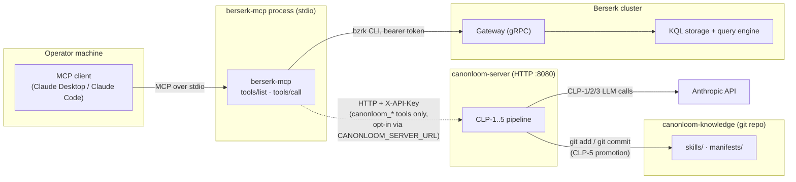

# CanonLoom: knowledge-artifact lifecycle bridge

**The problem it solves:** growing a library of good "skills" — runbooks,
incident patterns, lessons learned — normally means a human notices a source,
reads it, decides if it's new or a duplicate, distills it into a clean
document, checks it isn't garbage or a prompt-injection attempt, and files it
somewhere durable. That doesn't scale: sources show up faster than anyone can
manually curate them. The [parser factory](parser-factory.md) solves the
analogous problem for *telemetry sources* → verified, reusable KQL. CanonLoom
solves it for *knowledge sources* → it turns a source URL into a validated,
versioned skill artifact your agents can load later, through a five-phase
pipeline with a hard validation gate before anything is trusted, instead of
a human doing that work by hand.

**CanonLoom is a separate project**, not part of berserk-mcp. It ships its
own HTTP API server (`canonloom-server`) and its own knowledge repository.
berserk-mcp adds five tools that bridge to that API — it does not implement
any pipeline logic itself. If `canonloom-server` is not running, every
`canonloom_*` tool call returns one clear error instead of failing silently:

```text
CANONLOOM_SERVER_URL is not set. Start canonloom-server and set the URL.
Example: export CANONLOOM_SERVER_URL=http://localhost:8080
```

Side by side, feature and functionality wise:

| | Berserk | berserk-mcp | CanonLoom |
|---|---|---|---|
| Domain | Observability data — logs, metrics, traces | Agent-facing query layer over Berserk | Agent-facing knowledge-artifact lifecycle |
| Problem solved | Store and query telemetry at scale | Let an LLM ask Berserk questions without hand-authoring KQL | Let an LLM or operator turn a URL into a trustworthy, versioned skill without manual curation |
| Core unit | A log / metric / trace record | A verified tool call (e.g. `top_cpu`) | A skill artifact (`SKILL.md` + manifest) |
| Durable storage | Berserk's own KQL engine | None — stateless bridge | `canonloom-knowledge` git repo |
| Trust/validation model | n/a | Fixed, pre-verified queries — the model never authors KQL | A schema/semantic/injection/structural gate before anything is promoted |
| How they relate | The data source berserk-mcp queries | Depends on Berserk (via `bzrk`); no dependency on CanonLoom | Depends on neither — bridged in only as an optional HTTP client |

See [canonloom's own README](https://github.com/ssimonsen0202/canonloom#why-this-exists)
for the full why/what/how, the CLP-1 through CLP-5 pipeline-phase
reference, and `canonloom-server` setup. One gap worth knowing: CanonLoom
also has a **domain packs** capability (deterministic `.tar.gz` bundles of
validated artifacts for distribution) that this bridge exposes no tool for
yet — everything else (`run_pipeline`, artifact listing/lookup, freshness
scoring, run history) is covered by the five tools above.

## Deployment scenario

Both stacks run independently. The MCP client is the only thing that talks
to both — berserk-mcp itself never imports or embeds any CanonLoom code, it
only makes an HTTP call when a `canonloom_*` tool is invoked:



The dotted edge is the only connection between the two stacks, and it only
exists when `CANONLOOM_SERVER_URL` is set. Run berserk-mcp with no
`canonloom-server` anywhere and every other tool works exactly as documented
in the main [README](../README.md) — only the five `canonloom_*` calls
return the setup error shown above instead of a result. See
[canonloom's own README](https://github.com/ssimonsen0202/canonloom#relationship-to-berserk-and-berserk-mcp)
for the same diagram from the other side, and for what CanonLoom does when
there is no MCP client or Berserk cluster involved at all.

## The pipeline: CLP-1 through CLP-5

CanonLoom runs a source through five phases — intake, impact analysis, draft
generation, validation, promotion — stopping at the first one that fails.
See [canonloom's own README](https://github.com/ssimonsen0202/canonloom#what-it-does)
for what each phase does. What matters for this bridge:
`canonloom_run_pipeline`'s `stop_after` argument (`clp1`–`clp5`) lets you halt
early — for example `stop_after=clp2` to see the impact-analysis
recommendation without generating a draft, useful for a dry-run review before
committing LLM calls to CLP-3.

## Tools

| Tool | What it does |
|---|---|
| `canonloom_run_pipeline` | Submit a URL to the pipeline. Runs CLP-1 through CLP-5 (or stops early via `stop_after`). `auto_promote=true` commits the artifact automatically on a CLP-4 pass; default `false` leaves it in staging for review. |
| `canonloom_list_artifacts` | List promoted (validated/approved/published) skill artifacts. Pass `include_staging=true` to also list unpromoted drafts. |
| `canonloom_get_artifact` | Retrieve one artifact's manifest by `artifact_id`. |
| `canonloom_freshness_report` | Score every validated artifact's freshness on a configurable half-life (`half_life_days`, default 365) and surface deprecation candidates older than `min_age_days` (default 90). |
| `canonloom_run_history` | List recent pipeline runs, optionally filtered by outcome (`ok`/`rejected`), with the phase each run reached. |

## Configure

| Variable | Default | Purpose |
|---|---|---|
| `CANONLOOM_SERVER_URL` | unset | Base URL of the running `canonloom-server`, e.g. `http://localhost:8080`. Every `canonloom_*` tool call requires this; unset returns a clear setup error instead of failing silently. |
| `CANONLOOM_API_KEY` | unset | Sent as `X-API-Key` on every request, if the server requires it. |

## Running `canonloom-server`

`canonloom-server` is a separate project with its own install, Python
version floor, and environment requirements — none of it required by
berserk-mcp itself, only by this optional bridge target. See
[canonloom's own README](https://github.com/ssimonsen0202/canonloom#running-canonloom-server)
for the full setup (Python version, the `server` install extra, the `git`
CLI dependency, and the `CANONLOOM_KNOWLEDGE_ROOT` scaffold). berserk-mcp's
bridge is intentionally a thin pass-through and doesn't duplicate that
documentation here — the only things berserk-mcp needs are the two env vars
in the Configure table above, pointed at wherever `canonloom-server` ends up
running.

## Example

```
canonloom_run_pipeline url="https://docs.example.com/incident-runbook" stop_after="clp2"
```

returns the impact-analysis recommendation — `create`, `update`, or `skip` —
without spending an LLM call on draft generation. Once you're ready to
generate and commit:

```
canonloom_run_pipeline url="https://docs.example.com/incident-runbook" auto_promote=true
```

runs all five phases and commits the artifact to `canonloom-knowledge` if
CLP-4 validation passes.
