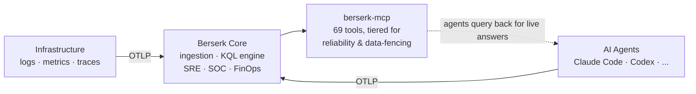
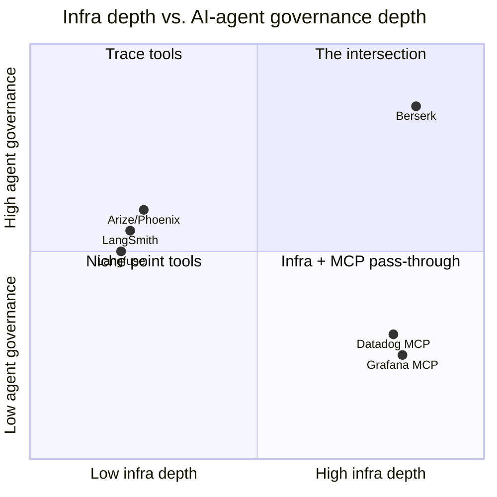

# Berserk MCP: the agent-facing layer of Berserk, and what it means for go-to-market

**Status: DRAFT** — investor briefing prepared 2026-08-23. Not yet reviewed/approved for external distribution.

How the MCP server complements the core Berserk platform, where that positions Berserk against the current observability and AI-governance market, and what it implies for go-to-market from here.

---

## 1. Product: Berserk MCP isn't a feature bolted onto Berserk — it's the loop that closes it

Berserk is a unified observability platform: infrastructure and security telemetry ingested via OTLP, queried through a KQL-style engine, with mature SRE and SOC analysis built on top. Berserk MCP exposes that same analytical depth to AI agents as directly callable tools — and, just as importantly, turns Berserk's lens back onto the agents themselves.

*Fig. 1 — Infrastructure and AI-agent telemetry share one ingestion path; agents query the same platform back out.*

This reflexive design is the point. berserk-mcp doesn't just let an agent ask "what's the error rate on checkout-service" and get a real answer instead of a hallucination. As of this week it also ingests the agents' own session activity — Claude Code today, Codex CLI now merged and shipped, more planned[^1] — back into Berserk. The same platform that tells an SRE what their infrastructure is doing now tells an engineering leader what their AI coding agents are doing, and what it's costing.

### Shipped today
- SRE & SOC analysis, mature — the pre-existing core
- Untrusted-data fencing: log/trace content is treated as attacker-influenceable, not trusted, by design
- Model-routing reliability validated empirically via OpenRouter — a neutral, vendor-agnostic test bed, not just against Anthropic's own models — across 8 real models spanning 2 local and 6 cloud providers[^5]
- Multi-agent telemetry ingestion (Claude Code + Codex), merged and shipped — a code review before merge caught and fixed 5 real reliability bugs in the ingestion path (silent data loss under concurrent writes, a state-corruption risk on a hard kill) that a happy-path test alone wouldn't have surfaced

> **What the OpenRouter testing actually found:** the reliability floor for this tool-calling design is the 24B-parameter model class, not "small" in general — a 12B model tested below a dumb keyword-matching baseline, while every 24B+ model cleared it comfortably, and the best performer (93% tool-selection, 98% argument accuracy) cost under $100/month for a 4-engineer team even at heavy usage.[^5] That's a measured claim about a specific, known limit — not a marketing "works with any model."

### The reflexive layer
- Per-feature and per-project AI cost economics, today
- Evidence-backed harness recommendations with an approve/reject audit trail
- Live quota-window visibility (planned, issue #43)
- Active kill-switch for runaway agent behavior (planned, issue #44)

---

## 2. Market: the market splits into two camps. Berserk is building the intersection.

The LLM observability market is sized at roughly $2.69B in 2026, heading toward $9.26B by 2030 — a 36.2% CAGR.[^2] But sizing the category obscures how it's actually structured today, and that structure is the opportunity.

> "Most production teams pick a primary [LLM-trace] observability platform … and pair it with the broader infrastructure observability layer … for whole-stack coverage."[^2] That pairing is two purchases, two consoles, two data models — for one workflow.

**Camp one — AI-native trace tools.** Langfuse, LangSmith, Arize/Phoenix, Braintrust: deep on the LLM call itself — spans, evals, node-by-node execution graphs. Genuinely strong at what they do. Shallow, by design, on infrastructure — they trace the agent, not the fleet it's running on.

**Camp two — infra incumbents, now with MCP.** This is where the ground moved under the "MCP is greenfield" assumption: Datadog shipped a GA MCP server in March 2026; Grafana shipped one covering Prometheus, Loki, and Tempo in early 2026.[^3] Deep infra, and now agents can query it. But the MCP layer, in both cases, reads as a pass-through onto existing dashboard queries — letting an agent ask about your infrastructure, not governing what the agent itself is doing or costing.

*Fig. 2 — Positioning by infra depth vs. AI-agent governance depth. Approximate, based on publicly described capabilities.*

AI-agent cost and behavior governance is not a niche concern to build the intersection around — it's becoming a mainstream enterprise priority in its own right. AWS launched a dedicated FinOps agent for AI cost governance in June 2026;[^4] industry survey data puts AI cost-management practice adoption near-universal (98%) among organizations running AI workloads.[^4] That validates demand for the governance layer Berserk has a head start on — and signals real, growing competitive attention at that layer specifically, not a permanently open field.

---

## 3. Go-to-market: what this changes about how Berserk should be sold

The shipped platform plus the near-term roadmap supports a specific reframe: stop selling "an observability platform with an AI feature," and start selling "the governance layer for the AI coding agents your engineering org has already adopted."

**Why the reframe matters.** Sold as observability, Berserk competes head-on with Datadog's incumbent budget line. Sold as AI-agent governance, it's a new, urgent, under-served line item — and the "we already have Datadog" objection stops being a blocker, because agent-governance is complementary even to shops keeping their existing infra tool.

### Two go-to-market motions, not one

| | Expand existing accounts | New-logo wedge |
|---|---|---|
| **Who** | Current SRE/SOC customers | Platform-eng / security buyers |
| **Motion** | Agent-governance as a natural extension of a platform they already run — no new vendor relationship | A motivated, reachable persona who've rolled out Claude Code / Copilot / Codex with zero cost or behavior visibility |
| **Trigger** | Eng org adopts more coding agents on data already flowing through the same pipeline | Independent of whether they use Berserk for infra today |

### The roadmap reads as a trajectory, not a feature list

| Today — Observe & analyze | Near-term — Quantify & alert | Mid-term — Govern & defend |
|---|---|---|
| Multi-agent telemetry ingestion | Live quota-window visibility (#43) | Active kill-switch for runaway agents (#44) |
| Cost / spend economics per feature & project | Weekly digest with one actionable tip (#46) | Hash-chained, exportable audit ledger (#17 / #19) |
| Reliability-engineered tool exposure | | ATT&CK-mapped agent security detection, portable to Sentinel/Defender (#29 / #30) |

That progression — from watching, to quantifying, to actively governing and defending — is a credible platform story, not a scramble of disconnected features. It's also the specific sequence a security-conscious buyer in the new-logo wedge would ask for, in the order they'd ask for it.

---

### Sources

[^1]: Codex CLI ingestion adapter merged 2026-08-23 (issue #42, PR #48) — code-reviewed pre-merge (5 reliability bugs found and fixed) and live-verified against real session data. OpenCode planned next.
[^2]: [MarkTechPost, "Top LLM Observability and Evaluation Platforms in 2026" (Aug 2026)](https://www.marktechpost.com/2026/08/09/top-llm-observability-and-evaluation-platforms-in-2026-langfuse-langsmith-braintrust-arize-and-more-compared/); market-dynamics framing per the same survey of current platforms.
[^3]: [Datadog MCP Server documentation](https://docs.datadoghq.com/mcp_server/); [Grafana Labs, MCP server for Prometheus/Loki/Tempo](https://grafana.com/blog/ai-observability-MCP-servers/).
[^4]: [SiliconANGLE, "AWS launches FinOps agent to bring AI cost governance to cloud spend" (Jun 2026)](https://siliconangle.com/2026/06/11/aws-launches-finops-agent-bring-ai-cost-governance-cloud-spend-finopsx/); adoption figure per FinOps Foundation "State of FinOps 2026" survey commentary.
[^5]: Full methodology, per-model table, and cost/caching analysis: [`model-routing-cost-validation-2026-08-23.md`](model-routing-cost-validation-2026-08-23.md). Models tested: 2 local (Ollama, Qwen2.5:7b / Llama3.1:8b) and 6 via OpenRouter (mistral-nemo, mistral-saba, mistral-small-3.2-24b-instruct, deepseek-v4-flash, deepseek-chat, stealth/ox-alpha). Caveat carried over honestly from that document: this is a first real data pass on this repo's own 69-tool schema, not yet a fully guardrailed model-ladder sweep (provider pinning and forced tool-parameter passthrough were not both applied) — directionally solid, not the final word.

### Related

- Full designed version (diagrams, print-page layout): published as a Claude Artifact, link held by whoever prepared this draft — not embedded here since artifact URLs are private/session-scoped.
- [`model-routing-cost-validation-2026-08-23.md`](model-routing-cost-validation-2026-08-23.md) — the underlying eval data behind the OpenRouter testing claims in section 1.
- [`berserk-dev-brief-2026-08-20.md`](berserk-dev-brief-2026-08-20.md) — the engineering-facing counterpart to this brief, independently confirms the same Datadog/Grafana MCP-GA competitive facts and covers the reliability-measurement methodology (and its current gaps) in full rigor.
